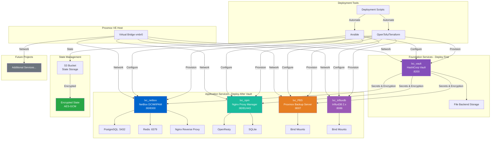
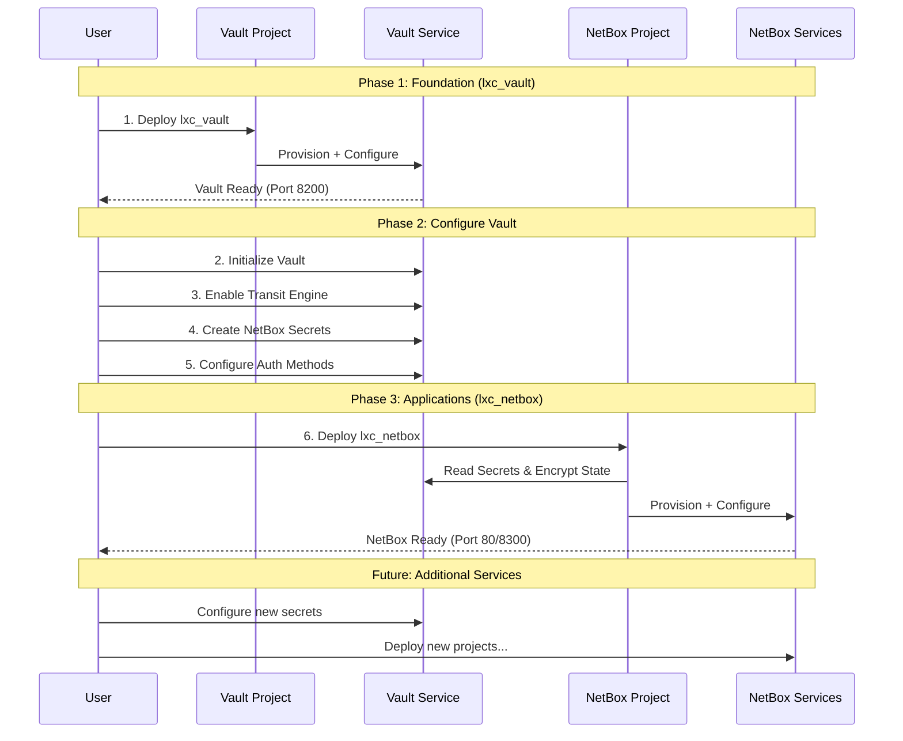

# HomeLab Infrastructure (Proxmox)

[](https://opentofu.org/)
[](https://www.ansible.com/)
[](https://www.proxmox.com/)

Infrastructure as Code (IaC) repository for automated deployment of services in Proxmox LXC containers using OpenTofu/Terraform and Ansible.

## 📋 Table of Contents

- [Overview](#-overview)
- [Architecture](#️-architecture)
- [Projects](#-projects)
- [Deployment Order](#-deployment-order)
- [Getting Started](#-getting-started)
- [Common Prerequisites](#-common-prerequisites)
- [Project Structure](#-project-structure)
- [Contributing](#-contributing)

## 🔍 Overview

This repository contains multiple Infrastructure as Code projects for deploying various services in Proxmox LXC containers. Each project follows a standardized structure with automated deployment scripts, comprehensive documentation, and Ansible-based configuration management.

### Common Features Across All Projects

- **Infrastructure Provisioning**: OpenTofu/Terraform creates and configures LXC containers
- **Configuration Management**: Ansible installs and configures services with best practices
- **State Encryption**: AES-GCM encryption for Terraform state files (PBKDF2 or Vault Transit)
- **Remote State Storage**: S3-compatible backend with locking support
- **Automated Deployment**: Interactive and CLI deployment scripts
- **Comprehensive Documentation**: README, DEPLOYMENT guides, and quick references

## 🏗️ Architecture



### Deployment Sequence



## 📁 Projects

### 1. **lxc_vault** - HashiCorp Vault (Foundation Service)

**Purpose**: Secrets management and encryption-as-a-service

**Status**: ✅ Production-ready with full automation

**Key Features**:

- Self-contained deployment (no external dependencies)
- Automated initialization and unsealing
- File-based backend storage
- PBKDF2 + AES-GCM state encryption
- Comprehensive documentation and automation

**Documentation**: See [lxc_vault/README.md](lxc_vault/README.md)

**Deployment Order**: 🥇 **Deploy First** - Required for other projects

---

### 2. **lxc_netbox** - NetBox DCIM/IPAM

**Purpose**: Network infrastructure documentation and IP address management

**Status**: ✅ Production-ready with Vault integration

**Key Features**:

- Multi-service stack (PostgreSQL + Redis + NetBox + Nginx)
- Full Vault integration for secrets management
- Vault Transit engine for state encryption
- Automated secret generation and storage
- Dynamic port detection (80 or 8300)

**Documentation**: See [lxc_netbox/README.md](lxc_netbox/README.md)

**Deployment Order**: 🥈 **Deploy Second** - Requires lxc_vault

**Prerequisites**:

- lxc_vault must be deployed and configured
- Vault Transit engine enabled
- Required secrets stored in Vault KV
- Vault authentication configured (userpass)

---

### 3. **lxc_base_template** - LXC Container Template

**Purpose**: Reusable template for creating new LXC container projects

**Status**: 📋 Template (not directly deployable)

**Key Features**:

- Starting point for new LXC container projects
- Vault integration for secrets management
- Automatic NetBox registration
- Modular architecture (scripts/, terraform/, ansible/)
- Security hardened (SSH key-only, UFW firewall)

**Documentation**: See [lxc_base_template/README.md](lxc_base_template/README.md)

**Usage**: Copy this template to create new container projects

---

### 4. **netbox_settings_template** - NetBox Configuration

**Purpose**: Data-driven configuration of NetBox instance settings

**Status**: 📋 Template for NetBox initial configuration

**Key Features**:

- Data-driven configuration via `terraform.tfvars`
- Bulk creation of Sites, Prefixes, VLANs, Device Types
- Vault integration for API token and state encryption
- S3 remote backend with state locking
- Covers Organization, IPAM, DCIM, Virtualization

**Documentation**: See [netbox_settings_template/README.md](netbox_settings_template/README.md)

**Deployment Order**: 🥉 **After NetBox** - Requires working NetBox instance

**Prerequisites**:

- lxc_netbox deployed and running
- NetBox API token stored in Vault
- Vault Transit engine for state encryption

---

### 5. **lxc_npm** - Nginx Proxy Manager

**Purpose**: Reverse proxy management with SSL certificate automation

**Status**: ✅ Production-ready with Vault integration

**Key Features**:

- OpenResty-based reverse proxy management
- Let's Encrypt SSL certificate automation (DNS challenge support)
- Web-based UI for proxy host configuration
- Full Vault integration for secrets management
- Vault Transit engine for state encryption
- Data persistence via bind mounts

**Documentation**: See [lxc_npm/README.md](lxc_npm/README.md)

**Deployment Order**: 🥈 **Deploy After Vault** - Requires lxc_vault

**Prerequisites**:

- lxc_vault must be deployed and configured
- Vault Transit engine enabled
- Required secrets stored in Vault KV
- Vault authentication configured (userpass)

---

### 6. **lxc_PBS** - Proxmox Backup Server

**Purpose**: Enterprise backup solution for Proxmox VE and other systems

**Status**: ✅ Production-ready with Vault integration

**Key Features**:

- Proxmox Backup Server from official repositories
- Data persistence via bind mounts (config and datastore)
- Full Vault integration for secrets management
- Vault Transit engine for state encryption
- **Unprivileged container** with proper UID/GID mapping for bind mounts
- Web UI on port 8007

**Documentation**: See [lxc_PBS/README.md](lxc_PBS/README.md)

**Deployment Order**: 🥈 **Deploy After Vault** - Requires lxc_vault

**Prerequisites**:

- lxc_vault must be deployed and configured
- Vault Transit engine enabled
- Required secrets stored in Vault KV
- Vault authentication configured (userpass)
- Host paths for bind mounts must exist

---

### 7. **lxc_influxdb** - InfluxDB Time-Series Database

**Purpose**: Time-series database for metrics, monitoring, and IoT data

**Status**: ✅ Production-ready with Vault integration

**Key Features**:

- InfluxDB 2.x with built-in UI and Flux query language
- Data persistence via bind mounts (BoltDB and Engine)
- Automated initial setup (admin user, org, bucket)
- Full Vault integration for secrets management
- Vault Transit engine for state encryption
- **Unprivileged container** with proper UID/GID mapping for bind mounts
- Web UI and API on port 8086

**Documentation**: See [lxc_influxdb/README.md](lxc_influxdb/README.md)

**Deployment Order**: 🥈 **Deploy After Vault** - Requires lxc_vault

**Prerequisites**:

- lxc_vault must be deployed and configured
- Vault Transit engine enabled
- Required secrets stored in Vault KV
- Vault authentication configured (userpass)
- Host paths for bind mounts must exist

---

### 8. **lxc_grafana** - Grafana Observability Platform

**Purpose**: Visualization and observability platform for metrics, logs, and traces

**Status**: ✅ Production-ready with Vault integration

**Key Features**:

- Grafana OSS from official APT repository
- Data persistence via bind mount (`/var/lib/grafana`)
- InfluxDB integration as default data source
- **Unprivileged container** with UID 900 → 100900 mapping
- Vault integration for secrets
- Web UI on port 3000

**Documentation**: See [lxc_grafana/README.md](lxc_grafana/README.md)

**Deployment Order**: 🥈 **Deploy After Vault** - Requires lxc_vault

**Prerequisites**:

- lxc_vault must be deployed and configured
- Vault Transit engine enabled
- Required secrets stored in Vault KV
- Vault authentication configured (userpass)
- Host paths for bind mounts must exist
- Optional: lxc_influxdb for time-series data source

---

### 9. **Future Projects**

Additional services will be added following the same patterns and deployment order dependencies.

## 🚀 Deployment Order

**CRITICAL**: Projects must be deployed in the correct order due to dependencies.

### Phase 1: Foundation (Required First)

1. **lxc_vault** - Deploy HashiCorp Vault

   ```bash
   cd lxc_vault
   ./deploy.sh deploy
   ```

2. **Configure Vault** - Set up for dependent services
   - Initialize and unseal Vault
   - Enable Transit encryption engine
   - Create KV secrets for dependent services
   - Configure authentication methods (userpass, token)
   - Create access policies

### Phase 2: Application Services

1. **lxc_netbox** - Deploy NetBox (requires Vault)

   ```bash
   cd lxc_netbox
   ./deploy.sh deploy
   ```

2. **lxc_npm** - Deploy Nginx Proxy Manager (requires Vault)

   ```bash
   cd lxc_npm
   ./deploy.sh deploy
   ```

3. **lxc_PBS** - Deploy Proxmox Backup Server (requires Vault)

   ```bash
   cd lxc_PBS
   ./deploy.sh deploy
   ```

4. **lxc_influxdb** - Deploy InfluxDB (requires Vault)

   ```bash
   cd lxc_influxdb
   ./deploy.sh deploy
   ```

### Phase 3: Future Services

1. **Additional Projects** - Deploy as needed

   - Each project's README will specify its dependencies
   - Follow deployment order documented in each project

### Dependency Matrix

| Project | Depends On | Required Vault Setup |
| --------- | ----------- | --------------------- |
| **lxc_vault** | None | N/A (foundation) |
| **lxc_netbox** | lxc_vault | Transit engine, KV secrets, userpass auth |
| **lxc_npm** | lxc_vault | Transit engine, KV secrets, userpass auth |
| **lxc_PBS** | lxc_vault | Transit engine, KV secrets, userpass auth |
| **lxc_influxdb** | lxc_vault | Transit engine, KV secrets, userpass auth |
| **lxc_base_template** | lxc_vault, lxc_netbox | Credentials, NetBox API token |
| **netbox_settings_template** | lxc_netbox | NetBox API token, Transit engine |

## 🎯 Getting Started

### Quick Start

1. **Clone the repository**

   ```bash
   git clone <repository-url>
   cd HomeLab(Proxmox)
   ```

2. **Deploy Vault (Foundation)**

   ```bash
   cd lxc_vault
   cp terraform/terraform.tfvars.example terraform/terraform.tfvars
   cp terraform/s3.backend.config.template terraform/s3.backend.config
   cp ansible/inventory.yml.example ansible/inventory.yml
   # Edit configuration files with your values
   ./deploy.sh deploy
   ```

3. **Configure Vault**

   ```bash
   # Initialize Vault (automatically done by deploy.sh)
   # Enable Transit engine and create secrets for other services
   # See lxc_vault/README.md for details
   ```

4. **Deploy NetBox (or other services)**

   ```bash
   cd ../lxc_netbox
   cp terraform/terraform.tfvars.example terraform/terraform.tfvars
   cp terraform/s3.backend.config.template terraform/s3.backend.config
   cp ansible/inventory.yml.example ansible/inventory.yml
   # Edit configuration files with your values
   ./deploy.sh deploy
   ```

### Recommended Reading Order

1. Start with [lxc_vault/README.md](lxc_vault/README.md) - Understand the foundation
2. Read [lxc_vault/DEPLOYMENT.md](lxc_vault/DEPLOYMENT.md) - Detailed deployment guide
3. Review [lxc_netbox/README.md](lxc_netbox/README.md) - Understand NetBox architecture
4. Check [lxc_netbox/DEPLOYMENT.md](lxc_netbox/DEPLOYMENT.md) - NetBox-specific deployment

## 📋 Common Prerequisites

All projects share these common requirements:

### Infrastructure

- **Proxmox VE**: Version 8.x or higher
- **Network**: Virtual bridge (vmbr0) configured
- **Storage**: Sufficient storage for LXC containers
- **Authentication**: root@pam credentials (required for bind mounts)

### Control Machine (Your Workstation)

- **OpenTofu/Terraform**: 1.8+ (OpenTofu) or Terraform 1.5+
- **Ansible**: 2.15 or higher
- **SSH**: SSH client with key-based authentication
- **S3 Storage**: S3-compatible storage for state files (optional, can use local backend)

### Network Access

- SSH access to Proxmox host (port 22)
- Access to Proxmox API (port 8006)
- Network connectivity for container access

### Credentials & Secrets

- Proxmox API token or password
- SSH keys for container access
- S3 credentials (if using remote state)
- State encryption passphrase or Vault access

## 📂 Project Structure

Each project follows this standardized structure:

```text
lxc_<service>/
├── README.md                    # Project overview and documentation
├── DEPLOYMENT.md                # Detailed deployment guide
├── QUICKREF.sh                  # Quick reference commands
├── deploy.sh                    # Automated deployment script
├── .gitignore                   # Git ignore patterns
├── logs/                        # Deployment logs directory
│   └── README.md                # Log management documentation
├── terraform/                   # Infrastructure provisioning
│   ├── main.tf                  # Main Terraform configuration
│   ├── variables.tf             # Variable definitions
│   ├── outputs.tf               # Output definitions
│   ├── providers.tf             # Provider configurations
│   ├── backend.tf               # State backend configuration
│   ├── encryption.tf            # State encryption configuration
│   ├── terraform.tfvars.example # Example variables file
│   └── s3.backend.config.template # Example backend config
└── ansible/                     # Configuration management
    ├── site.yml                 # Main playbook
    ├── ansible.cfg              # Ansible configuration
    ├── inventory.yml.example    # Example inventory
    └── roles/                   # Ansible roles
        └── <role_name>/         # Individual roles
            ├── README.md        # Role documentation
            ├── tasks/           # Role tasks
            ├── templates/       # Jinja2 templates
            ├── handlers/        # Ansible handlers
            └── meta/            # Role metadata
```

### Standardized Files

All projects include:

- ✅ **README.md** - Comprehensive project documentation
- ✅ **DEPLOYMENT.md** - Step-by-step deployment instructions
- ✅ **deploy.sh** - Automated deployment script with interactive menu
- ✅ **QUICKREF.sh** - Quick reference guide for common operations
- ✅ **logs/README.md** - Log management and retention policies
- ✅ **\*.example files** - Template configuration files
- ✅ **Role READMEs** - Documentation for each Ansible role

### Common Patterns

- **State Encryption**: All projects use encrypted Terraform state
- **Example Files**: All sensitive config files have .example templates
- **Logging**: Deployment scripts log to timestamped files in logs/
- **Pre-flight Checks**: Scripts validate prerequisites before deployment
- **Interactive & CLI Modes**: Scripts support both interactive and automated workflows

## 🔐 Security Considerations

### General Best Practices

1. **Never commit secrets** - Use .gitignore to protect sensitive files
2. **Use encrypted state** - All projects use state encryption (PBKDF2 or Vault Transit)
3. **Rotate credentials** - Regularly rotate API tokens, passwords, and keys
4. **Limit access** - Use least privilege principles for all credentials
5. **Audit logs** - Review deployment logs regularly

### Unprivileged Containers & UID Mapping

All LXC containers in this project run in **unprivileged mode** for enhanced security. This requires understanding UID/GID mapping:

#### How UID Mapping Works

| Inside Container | On Proxmox Host |
| ------------------ | ----------------- |
| root (UID 0) | 100000 |
| UID 34 | 100034 |
| UID 100 | 100100 |
| UID 900 | 100900 |

**Formula**: `Host UID = 100000 + Container UID`

#### Service User Mappings by Project

| Project | Service User | Container UID/GID | Host UID/GID | Bind Mount Path |
| --------- | -------------- | ------------------- | -------------- | ----------------- |
| lxc_vault | vault | 900 | 100900 | `/var/lib/vault/data` |
| lxc_influxdb | influxdb | 900 | 100900 | `/var/lib/influxdb` |
| lxc_netbox | netbox | 900 | 100900 | N/A (PostgreSQL/Redis use different UIDs) |
| lxc_PBS | backup | 34 | 100034 | `/etc/proxmox-backup`, `/mnt/pbs-backups` |
| lxc_npm | npm | 900 | 100900 | `/data`, `/etc/letsencrypt` |

#### Bind Mount Permissions

```bash
# Vault (UID 900 → 100900)
chown -R 100900:100900 /rpool/data/vault

# InfluxDB (UID 900 → 100900)
chown -R 100900:100900 /rpool/data/influxdb

# Grafana (UID 900 → 100900)
chown -R 100900:100900 /rpool/data/grafana

# PBS (UID 34 → 100034)
chown -R 100034:100034 /rpool/data/pbs-config
chown -R 100034:100034 /backup-store/pbs-backups

# NPM (UID 900 → 100900)
chown -R 100900:100900 /rpool/data/npm-data
chown -R 100900:100900 /rpool/data/npm-ssl

# NetBox PostgreSQL (UID 105 → 100105, GID 109 → 100109)
chown -R 100105:100109 /rpool/data/netbox-db

# NetBox Redis (UID 900 → 100900)
chown -R 100900:100900 /rpool/data/netbox-redis
```

#### Troubleshooting Permission Issues

If you encounter permission errors:

1. Check the service user UID inside the container: `id <username>`
2. Calculate the host UID: `container_uid + 100000`
3. Fix host permissions: `chown -R <host_uid>:<host_gid> /path/to/bind/mount`
4. Restart the service inside the container

#### Automated Permission Fix

Each project includes a `fix_bind_mount_permissions.sh` script (from `lxc_base_template`) that Terraform executes automatically to set proper ownership on bind mount directories.

### Per-Project Security

- **lxc_vault**: Protect unseal keys, use auto-unseal in production
- **lxc_netbox**: Store all secrets in Vault, use Transit encryption

### Network Security

- Configure firewalls to limit access to services
- Use VPN or bastion hosts for remote access
- Enable TLS/HTTPS for production deployments

## 🤝 Contributing

Contributions are welcome! When adding new projects:

1. Follow the standardized project structure
2. Include comprehensive documentation (README.md, DEPLOYMENT.md)
3. Create automated deployment script (deploy.sh)
4. Add QUICKREF.sh for common operations
5. Document dependencies and deployment order
6. Update this root README with the new project
7. Follow existing patterns for consistency

### Adding a New Project

1. Create project directory: `lxc_<service>/`
2. Copy structure from existing project (lxc_vault or lxc_netbox)
3. Update documentation with service-specific details
4. Test deployment workflow
5. Update deployment order in this README
6. Submit pull request

## 📖 Additional Resources

- [Proxmox VE Documentation](https://pve.proxmox.com/wiki/Main_Page)
- [OpenTofu Documentation](https://opentofu.org/docs/)
- [Ansible Documentation](https://docs.ansible.com/)
- [HashiCorp Vault Documentation](https://developer.hashicorp.com/vault/docs)
- [NetBox Documentation](https://docs.netbox.dev/)

## 📄 License

This project is licensed under the MIT License - see individual project LICENSE files for details.

---

**Last Updated**: January 25, 2026

**Maintained By**: HomeLab Infrastructure Team

For project-specific questions, see individual project README files.
