# HomeLab Infrastructure (Proxmox)

[](https://opentofu.org/)
[](https://www.ansible.com/)
[](https://www.proxmox.com/)

Infrastructure as Code (IaC) repository for automated deployment of services in Proxmox LXC containers using OpenTofu/Terraform and Ansible.

## 📋 Table of Contents

- [Overview](#-overview)
- [Architecture](#️-architecture)
- [Projects](#-projects)
- [Deployment Order](#-deployment-order)
- [Getting Started](#-getting-started)
- [Common Prerequisites](#-common-prerequisites)
- [Project Structure](#-project-structure)
- [Contributing](#-contributing)

## 🔍 Overview

This repository contains multiple Infrastructure as Code projects for deploying various services in Proxmox LXC containers. Each project follows a standardized structure with automated deployment scripts, comprehensive documentation, and Ansible-based configuration management.

### Common Features Across All Projects

- **Infrastructure Provisioning**: OpenTofu/Terraform creates and configures LXC containers
- **Configuration Management**: Ansible installs and configures services with best practices
- **State Encryption**: AES-GCM encryption for Terraform state files (PBKDF2 or Vault Transit)
- **Remote State Storage**: S3-compatible backend with locking support
- **Automated Deployment**: Interactive and CLI deployment scripts
- **Comprehensive Documentation**: README, DEPLOYMENT guides, and quick references

## 🏗️ Architecture

```mermaid
graph TB
    subgraph "Deployment Tools"
        A[OpenTofu/Terraform]
        B[Ansible]
        C[Deployment Scripts]
    end
    
    subgraph "Proxmox VE Host"
        D[Virtual Bridge vmbr0]
    end
    
    subgraph "Foundation Services - Deploy First"
        E[lxc_vault<br/>HashiCorp Vault<br/>:8200]
        E1[File Backend Storage]
    end
    
    subgraph "Application Services - Deploy After Vault"
        F[lxc_netbox<br/>NetBox DCIM/IPAM<br/>:80/8300]
        F1[PostgreSQL :5432]
        F2[Redis :6379]
        F3[Nginx Reverse Proxy]
        NPM[lxc_npm<br/>Nginx Proxy Manager<br/>:80/81/443]
        NPM1[OpenResty]
        NPM2[SQLite]
        PBS[lxc_PBS<br/>Proxmox Backup Server<br/>:8007]
        PBS1[Bind Mounts]
        INFLUX[lxc_influxdb<br/>InfluxDB 2.x<br/>:8086]
        INFLUX1[Bind Mounts]
        GRAFANA[lxc_grafana<br/>Grafana OSS<br/>:3000]
        GRAFANA1[Bind Mounts]
        LOKI[lxc_grafana_loki<br/>Grafana Loki<br/>:3100]
        LOKI1[Bind Mounts]
        LOKI2[Authentik SSO]
        SEMA[lxc_semaphoreUI<br/>Semaphore UI<br/>:3000]
        SEMA1[Bind Mounts]
    end
    
    subgraph "State Management"
        G[S3 Bucket<br/>State Storage]
        H[Encrypted State<br/>AES-GCM]
    end
    
    subgraph "VM Services - Deploy After Vault"
        DOCKER[vm_docker-pool<br/>Docker + Portainer<br/>:9443]
        DOCKER1[Bind Mounts]
        AUTH[authentik<br/>SSO & IAM<br/>:9000/9443]
        OPENSUSE[vm_opensuseTumbleweed<br/>OpenSUSE Workstation<br/>Desktop Environment]
        OPENSUSE1[USB Passthrough]
        OPENSUSE2[Data Disk 50GB]
    end
    
    subgraph "Future Projects"
        I[Additional Services...]
    end
    
    A -->|Provision| E
    A -->|Provision| DOCKER
    A -->|Provision| OPENSUSE
    A -->|Provision| F
    A -->|Provision| NPM
    A -->|Provision| PBS
    A -->|Provision| INFLUX
    A -->|Provision| GRAFANA
    A -->|Provision| LOKI
    A -->|State| G
    G -->|Encrypted| H
    
    B -->|Configure| E
    B -->|Configure| F
    B -->|Configure| NPM
    B -->|Configure| PBS
    B -->|Configure| INFLUX
    B -->|Configure| GRAFANA
    B -->|Configure| LOKI
    B -->|Configure| OPENSUSE
    
    C -->|Automate| A
    C -->|Automate| B
    
    E --> E1
    E -->|Secrets & Encryption| F
    E -->|Secrets & Encryption| NPM
    E -->|Secrets & Encryption| PBS
    E -->|Secrets & Encryption| INFLUX
    E -->|Secrets & Encryption| GRAFANA
    E -->|Secrets & Encryption| LOKI
    E -->|Secrets & Encryption| DOCKER
    E -->|Secrets & Encryption| OPENSUSE
    
    F --> F1
    F --> F2
    F --> F3
    
    NPM --> NPM1
    NPM --> NPM2
    
    PBS --> PBS1
    
    INFLUX --> INFLUX1
    INFLUX -->|Data Source| GRAFANA
    
    GRAFANA --> GRAFANA1
    
    LOKI --> LOKI1
    LOKI -->|Data Source| GRAFANA
    LOKI --> LOKI2
    
    F -.->|Promtail Logs| LOKI
    NPM -.->|Promtail Logs| LOKI
    PBS -.->|Promtail Logs| LOKI
    INFLUX -.->|Promtail Logs| LOKI
    GRAFANA -.->|Promtail Logs| LOKI
    SEMA -.->|Promtail Logs| LOKI
    DOCKER -.->|Promtail Logs| LOKI
    OPENSUSE -.->|Promtail Logs| LOKI
    
    SEMA --> SEMA1
    
    DOCKER --> DOCKER1
    DOCKER -->|Deploy| AUTH
    
    OPENSUSE --> OPENSUSE1
    OPENSUSE --> OPENSUSE2
    
    AUTH -.->|SSO| GRAFANA
    AUTH -.->|SSO| SEMA
    AUTH -.->|SSO| DOCKER
    AUTH -.->|SSO| PBS
    AUTH -.->|SSO| INFLUX
    AUTH -.->|SSO| NPM
    AUTH -.->|SSO| E
    AUTH -.->|Forward Auth| LOKI
    AUTH -.->|SSO| F
    
    D -->|Network| E
    D -->|Network| F
    D -->|Network| NPM
    D -->|Network| PBS
    D -->|Network| INFLUX
    D -->|Network| GRAFANA
    D -->|Network| SEMA
    D -->|Network| DOCKER
    D -->|Network| OPENSUSE
    D -->|Network| I
    
    style E fill:#844fba,color:#fff
    style F fill:#0066cc,color:#fff
    style NPM fill:#1abc9c,color:#fff
    style PBS fill:#e67e22,color:#fff
    style INFLUX fill:#9b59b6,color:#fff
    style GRAFANA fill:#ff6b6b,color:#fff
    style DOCKER fill:#2496ED,color:#fff
    style OPENSUSE fill:#73BA25,color:#fff
    style AUTH fill:#fd4b2d,color:#fff
    style H fill:#28a745,color:#fff
    style I fill:#6c757d,color:#fff
```



### Deployment Sequence


## 📁 Projects

### 1. **lxc_vault** - HashiCorp Vault (Foundation Service)

**Purpose**: Secrets management and encryption-as-a-service

**Status**: ✅ Production-ready with full automation

**Key Features**:

- Self-contained deployment (no external dependencies)
- Automated initialization and unsealing
- File-based backend storage
- PBKDF2 + AES-GCM state encryption
- Comprehensive documentation and automation

**Documentation**: See [lxc_vault/README.md](lxc_vault/README.md)

**Deployment Order**: 🥇 **Deploy First** - Required for other projects

---

### 2. **lxc_netbox** - NetBox DCIM/IPAM

**Purpose**: Network infrastructure documentation and IP address management

**Status**: ✅ Production-ready with Vault integration

**Key Features**:

- Multi-service stack (PostgreSQL + Redis + NetBox + Nginx)
- Full Vault integration for secrets management
- Vault Transit engine for state encryption
- Automated secret generation and storage
- Dynamic port detection (80 or 8300)

**Documentation**: See [lxc_netbox/README.md](lxc_netbox/README.md)

**Deployment Order**: 🥈 **Deploy Second** - Requires lxc_vault

**Prerequisites**:

- lxc_vault must be deployed and configured
- Vault Transit engine enabled
- Required secrets stored in Vault KV
- Vault authentication configured (userpass)

---

### 3. **lxc_base_template** - LXC Container Template

**Purpose**: Reusable template for creating new LXC container projects

**Status**: 📋 Template (not directly deployable)

**Key Features**:

- Starting point for new LXC container projects
- Vault integration for secrets management
- Automatic NetBox registration
- Modular architecture (scripts/, terraform/, ansible/)
- Security hardened (SSH key-only, UFW firewall)

**Documentation**: See [lxc_base_template/README.md](lxc_base_template/README.md)

**Usage**: Copy this template to create new container projects

---

### 4. **netbox_settings_template** - NetBox Configuration

**Purpose**: Data-driven configuration of NetBox instance settings

**Status**: 📋 Template for NetBox initial configuration

**Key Features**:

- Data-driven configuration via `terraform.tfvars`
- Bulk creation of Sites, Prefixes, VLANs, Device Types
- Vault integration for API token and state encryption
- S3 remote backend with state locking
- Covers Organization, IPAM, DCIM, Virtualization

**Documentation**: See [netbox_settings_template/README.md](netbox_settings_template/README.md)

**Deployment Order**: 🥉 **After NetBox** - Requires working NetBox instance

**Prerequisites**:

- lxc_netbox deployed and running
- NetBox API token stored in Vault
- Vault Transit engine for state encryption

---

### 5. **lxc_npm** - Nginx Proxy Manager

**Purpose**: Reverse proxy management with SSL certificate automation

**Status**: ✅ Production-ready with Vault integration

**Key Features**:

- OpenResty-based reverse proxy management
- Let's Encrypt SSL certificate automation (DNS challenge support)
- Web-based UI for proxy host configuration
- Full Vault integration for secrets management
- Vault Transit engine for state encryption
- Data persistence via bind mounts

**Documentation**: See [lxc_npm/README.md](lxc_npm/README.md)

**Deployment Order**: 🥈 **Deploy After Vault** - Requires lxc_vault

**Prerequisites**:

- lxc_vault must be deployed and configured
- Vault Transit engine enabled
- Required secrets stored in Vault KV
- Vault authentication configured (userpass)

---

### 6. **lxc_PBS** - Proxmox Backup Server

**Purpose**: Enterprise backup solution for Proxmox VE and other systems

**Status**: ✅ Production-ready with Vault integration

**Key Features**:

- Proxmox Backup Server from official repositories
- Data persistence via bind mounts (config and datastore)
- Full Vault integration for secrets management
- Vault Transit engine for state encryption
- **Unprivileged container** with proper UID/GID mapping for bind mounts
- Web UI on port 8007

**Documentation**: See [lxc_PBS/README.md](lxc_PBS/README.md)

**Deployment Order**: 🥈 **Deploy After Vault** - Requires lxc_vault

**Prerequisites**:

- lxc_vault must be deployed and configured
- Vault Transit engine enabled
- Required secrets stored in Vault KV
- Vault authentication configured (userpass)
- Host paths for bind mounts must exist

---

### 7. **lxc_influxdb** - InfluxDB Time-Series Database

**Purpose**: Time-series database for metrics, monitoring, and IoT data

**Status**: ✅ Production-ready with Vault integration

**Key Features**:

- InfluxDB 2.x with built-in UI and Flux query language
- Data persistence via bind mounts (BoltDB and Engine)
- Automated initial setup (admin user, org, bucket)
- Full Vault integration for secrets management
- Vault Transit engine for state encryption
- **Unprivileged container** with proper UID/GID mapping for bind mounts
- Web UI and API on port 8086

**Documentation**: See [lxc_influxdb/README.md](lxc_influxdb/README.md)

**Deployment Order**: 🥈 **Deploy After Vault** - Requires lxc_vault

**Prerequisites**:

- lxc_vault must be deployed and configured
- Vault Transit engine enabled
- Required secrets stored in Vault KV
- Vault authentication configured (userpass)
- Host paths for bind mounts must exist

---

### 8. **lxc_grafana** - Grafana Observability Platform

**Purpose**: Visualization and observability platform for metrics, logs, and traces

**Status**: ✅ Production-ready with Vault integration

**Key Features**:

- Grafana OSS from official APT repository
- Data persistence via bind mount (`/var/lib/grafana`)
- InfluxDB integration as default data source
- **Unprivileged container** with UID 900 → 100900 mapping
- Vault integration for secrets
- Web UI on port 3000

**Documentation**: See [lxc_grafana/README.md](lxc_grafana/README.md)

**Deployment Order**: 🥈 **Deploy After Vault** - Requires lxc_vault

**Prerequisites**:

- lxc_vault must be deployed and configured
- Vault Transit engine enabled
- Required secrets stored in Vault KV
- Vault authentication configured (userpass)
- Host paths for bind mounts must exist
- Optional: lxc_influxdb for time-series data source

---

### 9. **lxc_grafana_loki** - Log Aggregation System

**Purpose**: Centralized log aggregation and querying with Authentik SSO integration

**Status**: ✅ Production-ready with multi-layer security

**Key Features**:

- Grafana Loki from official APT repository
- Data persistence via bind mounts (`/var/lib/loki/chunks`, `/var/lib/loki/rules`)
- **Authentik SSO** integration via Nginx Proxy Manager Forward Auth
- **Basic Auth** for Promtail agents (htpasswd)
- **UFW firewall** with IP whitelist (NPM + Grafana only)
- **Unprivileged container** with UID 900 → 100900 mapping
- Promtail agent for local log collection
- Web API on port 3100 (behind reverse proxy)

**Documentation**: See [lxc_grafana_loki/README.md](lxc_grafana_loki/README.md)

**Deployment Order**: 🥈 **Deploy After Vault** - Requires lxc_vault, lxc_npm, Authentik

**Prerequisites**:

- lxc_vault must be deployed and configured
- lxc_npm deployed with domain configured
- Authentik deployed via Docker with admin access
- Host paths for bind mounts must exist
- Domain name for HTTPS (Let's Encrypt via NPM)

---

### 9. **lxc_semaphoreUI** - Semaphore UI Automation

**Purpose**: Modern UI for Ansible, Terraform, and OpenTofu automation

**Status**: ✅ Production-ready with Vault integration

**Key Features**:

- Modern web UI for DevOps task management
- Data persistence via bind mount (`/var/lib/semaphore`)
- BoltDB embedded database for simplicity
- **Unprivileged container** with UID 900 → 100900 mapping
- Secure secret generation for cookies and encryption
- Web UI on port 3000

**Documentation**: See [lxc_semaphoreUI/README.md](lxc_semaphoreUI/README.md)

**Deployment Order**: 🥈 **Deploy After Vault** - Requires lxc_vault

**Prerequisites**:

- lxc_vault must be deployed and configured
- Vault Transit engine enabled
- Required secrets stored in Vault KV
- Host paths for bind mounts must exist

---

### 10. **vm_docker-pool** - Docker + Portainer VM

**Purpose**: Container orchestration platform with Docker CE and Portainer management UI

**Status**: ✅ Production-ready with Vault integration

**Key Features**:

- **First VM-based project** (Ubuntu Server 24.04.3 LTS)
- Docker CE + Docker Compose plugin installation
- Portainer CE for container management (port 9443)
- Cloud-init for initial VM provisioning
- Data persistence via bind mount (`/opt/portainer/data`)
- QEMU Guest Agent for Proxmox integration
- Docker daemon with log rotation (10MB max, 3 files)
- UFW firewall (SSH + Portainer only)

**Documentation**: See [vm_docker-pool/README.md](vm_docker-pool/README.md)

**Deployment Order**: 🥈 **Deploy After Vault** - Requires lxc_vault

**Prerequisites**:

- lxc_vault must be deployed and configured
- Vault Transit engine enabled
- Required secrets stored in Vault KV
- Vault authentication configured (userpass)
- Host paths for bind mounts must exist
- Ubuntu Server 24.04.3 LTS cloud image available

---

### 11. **authentik** - Identity and Access Management

**Purpose**: SSO and IAM solution for centralized authentication

**Status**: ✅ Container-ready (Docker Compose)

**Key Features**:

- Unified authentication across all services
- Support for OIDC, SAML, and LDAP
- Customizable login flows and branding
- Automated deployment via Portainer on `vm_docker-pool`
- Web UI on port 9000/9443

**Documentation**: See [docker-compose_templates/authentik/README.md](docker-compose_templates/authentik/README.md)

**Deployment Order**: 🥉 **Deploy After Docker** - Requires working Docker environment

**Prerequisites**:

- `vm_docker-pool` must be deployed and running
- Docker Compose plugin installed
- Portainer CE accessible for container management

---

### 12. **vm_opensuseTumbleweed** - OpenSUSE Tumbleweed Workstation

**Purpose**: Rolling-release Linux workstation VM with XFCE desktop and persistent storage

**Status**: ✅ Production-ready with Vault integration

**Key Features**:

- **OpenSUSE Tumbleweed** rolling-release distribution
- **UEFI/OVMF boot** for modern operating system support
- **XFCE Desktop** with Wayland/X11 support, SDDM display manager
- **VirtIO Display** (VirtIO-GPU) with USB tablet for noVNC/SPICE
- **X11 Server** (Xorg) with QXL video driver for VM graphics
- **VirtIO-FS Persistent Storage** (ZFS-backed /home and /etc, survives VM recreation)
- **USB Device Passthrough** (up to 4 devices - keyboard, mouse, peripherals)
- **Software Stack** (Docker, Brave browser, VSCode, Flatpak apps)
- **ZSH Shell** with Oh My Zsh and Powerlevel10k theme
- Cloud-init for initial VM provisioning
- QEMU Guest Agent for Proxmox integration
- Ansible-based configuration management
- Full Vault integration for secrets and state encryption

**Documentation**: See [vm_opensuseTumbleweed/README.md](vm_opensuseTumbleweed/README.md)

**Deployment Order**: 🥈 **Deploy After Vault** - Requires lxc_vault

**Prerequisites**:

- lxc_vault must be deployed and configured
- Vault Transit engine enabled
- Required secrets stored in Vault KV
- Vault authentication configured (userpass)
- ZFS datasets created on Proxmox host for VirtIO-FS
- Proxmox Directory Mappings configured (workstation_home, workstation_etc)
- OpenSUSE Tumbleweed cloud image available
- USB devices identified (optional, for passthrough)

---

### 13. **proxmox_bkup_client_script** - Automated PBS Backup for Proxmox Host

**Purpose**: Automated file-level backup of Proxmox host directories (e.g., `/rpool/datastore/*` with LXC bind mount data) to Proxmox Backup Server with **client-side encryption**

**Status**: ✅ Production-ready (host-level utility, fully tested)

**Key Features**:

- **Profile-based architecture** — multiple independent backup profiles
- **Client-side encryption (AES-256-GCM)** — encrypt backups before transmission (protects against PBS compromise)
- **Mount point traversal** — automatic `--include-dev` for bind mounts (includes LXC container data)
- **Systemd-native scheduling** — `OnCalendar` timers with persistent and randomized delay
- **Retention policies** — automatic pruning: keep-last, daily, weekly, monthly
- **Security hardened** — no `eval`/`source`, credentials separated, strict 0600 permissions, keyfile cleanup traps
- **Lock files** — PID-based locking prevents concurrent backup runs
- **Config validation** — validate schedule, permissions, paths, and encryption before first run
- **Management CLI** — `install`, `remove`, `status`, `test`, `run`, `validate`, `logs` commands
- **Systemd service hardening** — `ProtectSystem=strict`, `PrivateTmp`, `ProtectKernelTunables`
- **Comprehensive test suite** — 17 automated tests with mocked components (config parsing, encryption, security)

**Documentation**: See [proxmox_bkup_client_script/README.md](proxmox_bkup_client_script/README.md)

**Deployment Order**: 🔧 **Host Utility** - Runs on Proxmox host directly (requires `proxmox-backup-client` installed)

**Prerequisites**:

- Proxmox host with `proxmox-backup-client` installed
- Running Proxmox Backup Server (lxc_PBS or standalone) with a configured datastore
- PBS user/API token with `DatastoreBackup` + `DatastorePrune` permissions

---

### 14. **Ansible Base Scripts**

Collection of reusable Ansible playbooks for infrastructure maintenance and operations across Proxmox VMs and LXC containers.

#### 14.1 vms_packages_update

Optimized multi-OS package update playbook with enhanced error handling, security-only modes, and LXC container awareness.

**Purpose**: Automated OS package updates across heterogeneous Proxmox infrastructure (Debian, Ubuntu, RHEL, openSUSE)

**Status**: ✅ **Production-Ready** (Validated via SemaphoreUI)

**Key Features**:

- **Multi-OS support** — Debian/Ubuntu (apt), RHEL/Rocky/Alma (dnf/yum), openSUSE (zypper)
- **LXC container aware** — detects LXC containers and skips reboot operations (prevents provisioning errors)
- **Security-only mode** — `security_only: true` installs only security patches (Debian/Ubuntu unattended-upgrades, RHEL security filters)
- **Pre-deployment checks** — disk space validation (min 1GB free on `/`), network connectivity, Python interpreter verification
- **Error handling** — block/rescue patterns with failure reporting, OS-agnostic audit logging
- **Update statistics** — reports installed/upgraded/removed package counts per host
- **Idempotent operations** — safe for repeated execution, check mode support (`--check`)
- **Systemd service restarts** — automatic restart of services with updated packages (if `needrestart` installed)
- **Audit logging** — `/var/log/ansible-updates.log` with automatic rotation (10MB max, 3 files)

**Documentation**: See [ansible_base_scripts/vms_packages_update/README.md](ansible_base_scripts/vms_packages_update/README.md)

**Deployment Order**: 🔧 **Maintenance Utility** - Run after services are deployed (requires SSH access to all hosts)

**Prerequisites**:

- Ansible 2.15+ on control machine
- SSH access to all target VMs/containers with `ansible` user (or configured `ansible_user`)
- Python 3.x on all target hosts
- Sudo/root privileges on targets (for package installation)
- Valid inventory configuration (see `ansible_base_scripts/vms_packages_update/inventory.yml.example`)

**Integration**: Compatible with **SemaphoreUI** for scheduled task automation and execution logging

---

#### 14.2 promtail_remote_install

Automated Promtail deployment playbook for remote log collection to secured Grafana Loki instance.

**Purpose**: Install and configure Promtail agents on remote hosts to push logs to Loki via HTTPS + Basic Auth

**Status**: ✅ **Production-Ready** (Integrated with lxc_grafana_loki security architecture)

**Key Features**:

- **Automated installation** — Promtail from official Grafana APT repository
- **Secure configuration** — HTTPS + Basic Auth for Loki push endpoint
- **Flexible inventory** — Per-host job names and custom log paths
- **Idempotent operations** — Safe for repeated execution
- **Password management** — Secure password file creation with proper permissions (0600)
- **Service management** — Automatic Promtail service enable/start with systemd

**Documentation**: See [ansible_base_scripts/promtail_remote_install/README.md](ansible_base_scripts/promtail_remote_install/README.md)

**Deployment Order**: 🔧 **Maintenance Utility** - Run after lxc_grafana_loki is deployed and secured

**Prerequisites**:

- Ansible 2.15+ on control machine
- SSH access to target hosts (Debian/Ubuntu)
- lxc_grafana_loki deployed with NPM + Basic Auth configured
- Basic Auth password from NPM htpasswd file
- Target hosts running Debian/Ubuntu with sudo privileges

**Usage Example**:

```bash
cd ansible_base_scripts/promtail_remote_install
ansible-playbook -i inventory.yml playbook.yml \
  -e promtail_loki_url=https://loki.example.com \
  -e promtail_basic_auth_password=<password>
```

---

### 15. **Future Projects**

Additional services will be added following the same patterns and deployment order dependencies.

## 🐳 Docker Compose Templates

A collection of Docker Compose templates for rapid deployment of containerized services via Portainer.

**Documentation**: See [docker-compose_templates/README.md](docker-compose_templates/README.md)

1. **authentik**: SSO & Identity Management
2. **nextcloud-aio**: All-in-one personal cloud solution

## 🚀 Deployment Order

**CRITICAL**: Projects must be deployed in the correct order due to dependencies.

### Phase 1: Foundation (Required First)

1. **lxc_vault** - Deploy HashiCorp Vault

   ```bash
   cd lxc_vault
   ./deploy.sh deploy
   ```

2. **Configure Vault** - Set up for dependent services
   - Initialize and unseal Vault
   - Enable Transit encryption engine
   - Create KV secrets for dependent services
   - Configure authentication methods (userpass, token)
   - Create access policies

### Phase 2: Application Services

1. **lxc_netbox** - Deploy NetBox (requires Vault)

   ```bash
   cd lxc_netbox
   ./deploy.sh deploy
   ```

2. **lxc_npm** - Deploy Nginx Proxy Manager (requires Vault)

   ```bash
   cd lxc_npm
   ./deploy.sh deploy
   ```

3. **lxc_PBS** - Deploy Proxmox Backup Server (requires Vault)

   ```bash
   cd lxc_PBS
   ./deploy.sh deploy
   ```

4. **lxc_influxdb** - Deploy InfluxDB (requires Vault)

   ```bash
   cd lxc_influxdb
   export INFLUXDB_ADMIN_PASSWORD="your-password"
   ./deploy.sh deploy
   ```

5. **lxc_grafana** - Deploy Grafana (requires Vault, optional: InfluxDB)

   ```bash
   cd lxc_grafana
   export GRAFANA_ADMIN_PASSWORD="your-password"
   ./deploy.sh deploy
   ```

6. **lxc_semaphoreUI** - Deploy Semaphore UI (requires Vault)

   ```bash
   cd lxc_semaphoreUI
   export SEMAPHORE_ADMIN_PASSWORD="your-password"
   ./deploy.sh deploy
   ```

7. **vm_docker-pool** - Deploy Docker + Portainer VM (requires Vault)

   ```bash
   cd vm_docker-pool
   ./deploy.sh deploy
   ```

8. **vm_opensuseTumbleweed** - Deploy OpenSUSE Tumbleweed Workstation VM (requires Vault)

   ```bash
   cd vm_opensuseTumbleweed
   # Edit terraform/terraform.tfvars and terraform/s3.backend.config
   cd terraform
   tofu init -backend-config=s3.backend.config
   tofu apply
   # Then configure with Ansible
   cd ../ansible
   # Edit inventory.yml with VM IP
   ansible-playbook site.yml
   ```

### Phase 3: Future Services

1. **Additional Projects** - Deploy as needed

   - Each project's README will specify its dependencies
   - Follow deployment order documented in each project

### Dependency Matrix

| Project | Depends On | Required Vault Setup |
| --------- | ----------- | --------------------- |
| **lxc_vault** | None | N/A (foundation) |
| **lxc_netbox** | lxc_vault | Transit engine, KV secrets, userpass auth |
| **lxc_npm** | lxc_vault | Transit engine, KV secrets, userpass auth |
| **lxc_PBS** | lxc_vault | Transit engine, KV secrets, userpass auth |
| **lxc_influxdb** | lxc_vault | Transit engine, KV secrets, userpass auth |
| **lxc_grafana** | lxc_vault, (optional) lxc_influxdb | Transit engine, KV secrets, userpass auth |
| **lxc_semaphoreUI** | lxc_vault | Transit engine, KV secrets, userpass auth |
| **vm_docker-pool** | lxc_vault | Transit engine, KV secrets, userpass auth |
| **vm_opensuseTumbleweed** | lxc_vault | Transit engine, KV secrets, userpass auth |
| **authentik** | vm_docker-pool | Working Docker environment, Portainer CE |
| **lxc_base_template** | lxc_vault, lxc_netbox | Credentials, NetBox API token |
| **netbox_settings_template** | lxc_netbox | NetBox API token, Transit engine |

## 🎯 Getting Started

### Quick Start

1. **Clone the repository**

   ```bash
   git clone <repository-url>
   cd HomeLab(Proxmox)
   ```

2. **Deploy Vault (Foundation)**

   ```bash
   cd lxc_vault
   cp terraform/terraform.tfvars.example terraform/terraform.tfvars
   cp terraform/s3.backend.config.template terraform/s3.backend.config
   cp ansible/inventory.yml.example ansible/inventory.yml
   # Edit configuration files with your values
   ./deploy.sh deploy
   ```

3. **Configure Vault**

   ```bash
   # Initialize Vault (automatically done by deploy.sh)
   # Enable Transit engine and create secrets for other services
   # See lxc_vault/README.md for details
   ```

4. **Deploy NetBox (or other services)**

   ```bash
   cd ../lxc_netbox
   cp terraform/terraform.tfvars.example terraform/terraform.tfvars
   cp terraform/s3.backend.config.template terraform/s3.backend.config
   cp ansible/inventory.yml.example ansible/inventory.yml
   # Edit configuration files with your values
   ./deploy.sh deploy
   ```

### Recommended Reading Order

1. Start with [lxc_vault/README.md](lxc_vault/README.md) - Understand the foundation
2. Read [lxc_vault/DEPLOYMENT.md](lxc_vault/DEPLOYMENT.md) - Detailed deployment guide
3. Review [lxc_netbox/README.md](lxc_netbox/README.md) - Understand NetBox architecture
4. Check [lxc_netbox/DEPLOYMENT.md](lxc_netbox/DEPLOYMENT.md) - NetBox-specific deployment

## 📋 Common Prerequisites

All projects share these common requirements:

### Infrastructure

- **Proxmox VE**: Version 8.x or higher
- **Network**: Virtual bridge (vmbr0) configured
- **Storage**: Sufficient storage for LXC containers
- **Authentication**: root@pam credentials (required for bind mounts)

### Control Machine (Your Workstation)

- **OpenTofu/Terraform**: 1.8+ (OpenTofu) or Terraform 1.5+
- **Ansible**: 2.15 or higher
- **SSH**: SSH client with key-based authentication
- **S3 Storage**: S3-compatible storage for state files (optional, can use local backend)

### Network Access

- SSH access to Proxmox host (port 22)
- Access to Proxmox API (port 8006)
- Network connectivity for container access

### Credentials & Secrets

- Proxmox API token or password
- SSH keys for container access
- S3 credentials (if using remote state)
- State encryption passphrase or Vault access

## 📂 Project Structure

```text
lxc_<service> or vm_<service>/
├── README.md                      # Project overview and documentation
├── DEPLOYMENT.md                  # Detailed deployment guide
├── QUICKREF.sh                    # Quick reference commands
├── deploy.sh                      # Automated deployment script
├── .gitignore                     # Git ignore patterns
├── logs/                          # Deployment logs directory
│   └── README.md                  # Log management documentation
├── terraform/                     # Infrastructure provisioning
│   ├── main.tf                    # Main Terraform configuration
│   ├── variables.tf               # Variable definitions
│   ├── outputs.tf                 # Output definitions
│   ├── providers.tf               # Provider configurations
│   ├── backend.tf                 # State backend configuration
│   ├── encryption.tf              # State encryption configuration
│   ├── terraform.tfvars.example   # Example variables file
│   └── s3.backend.config.template # Example backend config
└── ansible/                       # Configuration management
    ├── site.yml                   # Main playbook
    ├── ansible.cfg                # Ansible configuration
    ├── inventory.yml.example      # Example inventory
    └── roles/                     # Ansible roles
        └── <role_name>/           # Individual roles
            ├── README.md          # Role documentation
            ├── tasks/             # Role tasks
            ├── templates/         # Jinja2 templates
            ├── handlers/          # Ansible handlers
            └── meta/              # Role metadata
```

### Standardized Files

All projects include:

- ✅ **README.md** - Comprehensive project documentation
- ✅ **DEPLOYMENT.md** - Step-by-step deployment instructions
- ✅ **deploy.sh** - Automated deployment script with interactive menu
- ✅ **QUICKREF.sh** - Quick reference guide for common operations
- ✅ **logs/README.md** - Log management and retention policies
- ✅ **\*.example files** - Template configuration files
- ✅ **Role READMEs** - Documentation for each Ansible role

### Common Patterns

- **State Encryption**: All projects use encrypted Terraform state
- **Example Files**: All sensitive config files have .example templates
- **Logging**: Deployment scripts log to timestamped files in logs/
- **Pre-flight Checks**: Scripts validate prerequisites before deployment
- **Interactive & CLI Modes**: Scripts support both interactive and automated workflows

## 🔐 Security Considerations

### General Best Practices

1. **Never commit secrets** - Use .gitignore to protect sensitive files
2. **Use encrypted state** - All projects use state encryption (PBKDF2 or Vault Transit)
3. **Rotate credentials** - Regularly rotate API tokens, passwords, and keys
4. **Limit access** - Use least privilege principles for all credentials
5. **Audit logs** - Review deployment logs regularly

### Unprivileged Containers & UID Mapping

All LXC containers in this project run in **unprivileged mode** for enhanced security. This requires understanding UID/GID mapping:

#### How UID Mapping Works

| Inside Container | On Proxmox Host |
| ------------------ | ----------------- |
| root (UID 0) | 100000 |
| UID 34 | 100034 |
| UID 100 | 100100 |
| UID 900 | 100900 |

**Formula**: `Host UID = 100000 + Container UID`

#### Service User Mappings by Project

| Project | Service User | Container UID/GID | Host UID/GID | Bind Mount Path |
| --------- | -------------- | ------------------- | -------------- | ----------------- |
| lxc_vault | vault | 900 | 100900 | `/var/lib/vault/data` |
| lxc_influxdb | influxdb | 900 | 100900 | `/var/lib/influxdb` |
| lxc_netbox | netbox | 900 | 100900 | N/A (PostgreSQL/Redis use different UIDs) |
| lxc_PBS | backup | 34 | 100034 | `/etc/proxmox-backup`, `/mnt/pbs-backups` |
| lxc_npm | npm | 900 | 100900 | `/data`, `/etc/letsencrypt` |
| lxc_semaphoreUI | semaphore | 900 | 100900 | `/var/lib/semaphore` |

> **Note**: VM projects (like `vm_docker-pool`) do not require UID mapping. They use standard Linux permissions with the service running as a regular user. Bind mount directories can be owned by root (0:0) or any appropriate user.

#### Bind Mount Permissions

```bash
# Vault (UID 900 → 100900)
chown -R 100900:100900 /rpool/data/vault

# InfluxDB (UID 900 → 100900)
chown -R 100900:100900 /rpool/data/influxdb

# Grafana (UID 900 → 100900)
chown -R 100900:100900 /rpool/data/grafana

# PBS (UID 34 → 100034)
chown -R 100034:100034 /rpool/data/pbs-config
chown -R 100034:100034 /backup-store/pbs-backups

# NPM (UID 900 → 100900)
chown -R 100900:100900 /rpool/data/npm-data
chown -R 100900:100900 /rpool/data/npm-ssl

# NetBox PostgreSQL (UID 105 → 100105, GID 109 → 100109)
chown -R 100105:100109 /rpool/data/netbox-db

# NetBox Redis (UID 900 → 100900)
chown -R 100900:100900 /rpool/data/netbox-redis

# Semaphore UI (UID 900 → 100900)
chown -R 100900:100900 /rpool/data/semaphoreUI
```

#### Troubleshooting Permission Issues

If you encounter permission errors:

1. Check the service user UID inside the container: `id <username>`
2. Calculate the host UID: `container_uid + 100000`
3. Fix host permissions: `chown -R <host_uid>:<host_gid> /path/to/bind/mount`
4. Restart the service inside the container

#### Automated Permission Fix

Each project includes a `fix_bind_mount_permissions.sh` script (from `lxc_base_template`) that Terraform executes automatically to set proper ownership on bind mount directories.

### Per-Project Security

- **lxc_vault**: Protect unseal keys, use auto-unseal in production
- **lxc_netbox**: Store all secrets in Vault, use Transit encryption

### Network Security

- Configure firewalls to limit access to services
- Use VPN or bastion hosts for remote access
- Enable TLS/HTTPS for production deployments

## 🤝 Contributing

Contributions are welcome! When adding new projects:

1. Follow the standardized project structure
2. Include comprehensive documentation (README.md, DEPLOYMENT.md)
3. Create automated deployment script (deploy.sh)
4. Add QUICKREF.sh for common operations
5. Document dependencies and deployment order
6. Update this root README with the new project
7. Follow existing patterns for consistency

### Adding a New Project

1. Create project directory: `lxc_<service>/`
2. Copy structure from existing project (lxc_vault or lxc_netbox)
3. Update documentation with service-specific details
4. Test deployment workflow
5. Update deployment order in this README
6. Submit pull request

## 📖 Additional Resources

- [Proxmox VE Documentation](https://pve.proxmox.com/wiki/Main_Page)
- [OpenTofu Documentation](https://opentofu.org/docs/)
- [Ansible Documentation](https://docs.ansible.com/)
- [HashiCorp Vault Documentation](https://developer.hashicorp.com/vault/docs)
- [NetBox Documentation](https://docs.netbox.dev/)

## 📄 License

This project is licensed under the MIT License - see individual project LICENSE files for details.

---

**Last Updated**: February 3, 2026

**Maintained By**: HomeLab Infrastructure Team

For project-specific questions, see individual project README files.
