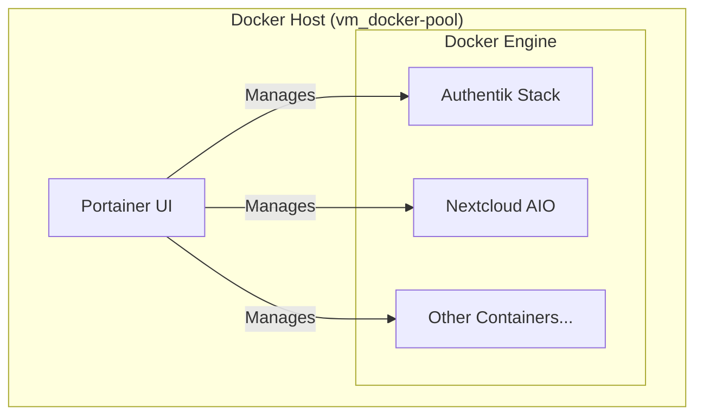

# Docker Compose Templates

[](https://www.docker.com/)
[](https://www.portainer.io/)

A collection of standardized Docker Compose templates for rapid deployment of containerized services. These templates are designed to be used in conjunction with the [vm_docker-pool](../vm_docker-pool/README.md) project and managed via Portainer.

## 📋 Table of Contents

- [Overview](#overview)
- [Available Templates](#available-templates)
- [Architecture](#architecture)
- [Prerequisites](#prerequisites)
- [Quick Start](#quick-start)
- [Project Structure](#project-structure)

## 🔍 Overview

These templates provide pre-configured stacks for common services used in the HomeLab infrastructure. Each template includes a `compose.yml` file and a corresponding `README.md` with specific setup instructions.

### Common Features

- **Standardized Structure**: Each template follows a consistent layout.
- **Environment Driven**: Configuration is managed via `.env` files.
- **Persistence**: Data persistence is handled via bind mounts or Docker volumes.
- **Portainer Ready**: Templates are optimized for deployment via Portainer's "Stacks" feature.

## 📦 Available Templates

### 1. [authentik](authentik/README.md)

**Purpose**: Identity and Access Management (SSO)

- Centralized authentication for the entire HomeLab.
- Integrated with NetBox, Grafana, and other services.

### 2. [nextcloud-aio](nextcloud-aio/README.md)

**Purpose**: All-in-one personal cloud solution

- File storage, calendar, contacts, and collaboration tools.

## 🏗️ Architecture



## 📋 Prerequisites

1. **Docker VM**: [vm_docker-pool](../vm_docker-pool/README.md) must be deployed.
2. **Access**: Access to Portainer UI (usually port 9443).
3. **Storage**: Host directories for bind mounts (if applicable).

## 🚀 Quick Start

1. **Navigate** to the specific template directory.
2. **Copy** `.env` example (if provided) and fill in your values.
3. **Deploy** via Portainer:
   - Go to **Stacks** -> **Add stack**.
   - Copy the content of `compose.yml` (or upload the file).
   - Add environment variables.
   - Click **Deploy the stack**.

## 📂 Project Structure

```text
docker-compose_templates/
├── README.md              # This file
├── authentik/             # Authentik SSO template
│   ├── compose.yml        # Docker Compose file
│   └── README.md          # Setup instructions
└── nextcloud-aio/         # Nextcloud AIO template
    ├── compose.yml        # Docker Compose file
    └── README.md          # Setup instructions
```
