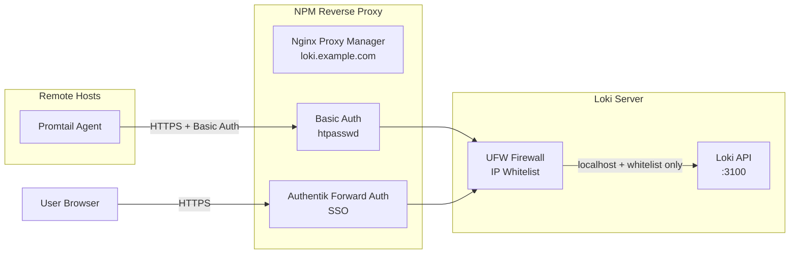

# Grafana Loki LXC Container Deployment

Grafana Loki log aggregation system deployed in Proxmox LXC container with Vault integration and data persistence.

## Features

- **Grafana Loki** – Horizontally scalable log aggregation from official APT repository
- **Promtail** – Log shipping agent for collecting and forwarding local logs
- **Data Persistence** – Bind mounts for `/var/lib/loki/chunks` and `/var/lib/loki/rules`
- **Vault Integration** – Secrets management via HashiCorp Vault
- **NetBox Registration** – Automatic IPAM and inventory tracking
- **Unprivileged Container** – Enhanced security with UID 900 → 100900 mapping
- **Security Hardened** – SSH keys, UFW firewall, minimal attack surface
- **Authentik SSO Integration** – Forward Auth for web access via Nginx Proxy Manager
- **Basic Auth for Agents** – htpasswd authentication for Promtail push endpoints

## 🔐 Security Architecture

This deployment implements **defense-in-depth** security with three layers:



### Security Layers

1. **Network Isolation (UFW)**
   - Port 3100 accessible only from:
     - `127.0.0.1` (localhost Promtail)
     - NPM reverse proxy IP
     - Grafana data source IP
   - Direct IP access blocked

2. **Reverse Proxy Authentication**
   - **Write path** (`/loki/api/v1/push`): Basic Auth for Promtail agents
   - **Read path** (all other endpoints): Authentik SSO for humans
   - **Health/metrics** (`/ready`, `/metrics`): No auth (monitoring)

3. **TLS Encryption**
   - All external traffic via HTTPS (Let's Encrypt)
   - Internal traffic over trusted network

## Quick Start

1. **Deploy**:

   ```bash
   ./deploy.sh deploy
   ```

2. **Verify Loki is running**:
   - HTTP API: `http://<container-ip>:3100/ready`
   - Metrics: `http://<container-ip>:3100/metrics`

## Configuration

### Terraform Variables (`terraform.tfvars`)

| Variable | Default | Description |
| -------- | ------- | ----------- |
| `lxc_id` | `108` | Container VMID |
| `lxc_hostname` | `grafana-loki` | Container hostname |
| `lxc_ip_address` | `dhcp` | Static IP with CIDR |
| `lxc_memory` | `2048` | RAM in MB |
| `lxc_cpu_cores` | `2` | CPU cores |
| `lxc_disk_size` | `20` | Root disk size in GB |
| `lxc_grafana_loki_chunks_mount_volume` | `/rpool/data/grafana_loki/chunks` | Host path for chunks data |
| `lxc_grafana_loki_rules_mount_volume` | `/rpool/data/grafana_loki/rules` | Host path for rules data |

### UID Mapping (Unprivileged Container)

| Inside Container | On Proxmox Host |
| ---------------- | --------------- |
| loki (UID 900) | 100900 |
| root (UID 0) | 100000 |

**Host bind mount permissions** are automatically set by the deployment script:

```bash
# Automatically configured during deployment
chown -R 100900:100900 /rpool/data/grafana_loki/chunks
chown -R 100900:100900 /rpool/data/grafana_loki/rules
```

> [!NOTE]
> See the main [README.md](../README.md#unprivileged-containers--uid-mapping) for more details on UID mapping.

## Ports

| Port | Protocol | Description |
| ---- | -------- | ----------- |
| 22 | TCP | SSH |
| 3100 | TCP | Loki HTTP API |
| 9096 | TCP | Loki gRPC (internal) |
| 9080 | TCP | Promtail HTTP (internal) |

## Data Persistence

Loki data is stored in bind mounts:

| Data | Host Path | Container Path |
| ---- | --------- | -------------- |
| Chunks | `/rpool/data/grafana_loki/chunks` | `/var/lib/loki/chunks` |
| Rules | `/rpool/data/grafana_loki/rules` | `/var/lib/loki/rules` |

Data persists across container recreation.

## Post-Deployment Security Setup

### Prerequisites

- **Nginx Proxy Manager** (lxc_npm) deployed and accessible
- **Authentik** (deployed via Docker) configured with admin access
- **Domain name** pointing to NPM (e.g., `loki.example.com`)

### Step 1: Configure NPM Reverse Proxy

1. **Create Proxy Host** in NPM UI:
   - Domain: `loki.example.com`
   - Forward: `http://<loki-ip>:3100`
   - SSL: Let's Encrypt + Force SSL

2. **Generate htpasswd** for Promtail:

   ```bash
   sudo apt install apache2-utils
   sudo htpasswd -c /data/nginx/custom/.htpasswd_loki promtail
   ```

3. **Add Custom Nginx Config** (NPM → Advanced tab):

   ```nginx
   # Promtail push — Basic Auth
   location /loki/api/v1/push {
       auth_basic "Loki Push";
       auth_basic_user_file /data/nginx/custom/.htpasswd_loki;
       proxy_pass http://<loki-ip>:3100;
       proxy_set_header Host $host;
       proxy_set_header X-Real-IP $remote_addr;
       proxy_set_header X-Forwarded-For $proxy_add_x_forwarded_for;
       proxy_set_header X-Forwarded-Proto $scheme;
   }
   
   # Health/metrics — no auth
   location /ready { proxy_pass http://<loki-ip>:3100; }
   location /metrics { proxy_pass http://<loki-ip>:3100; }
   ```

### Step 2: Configure Authentik Forward Auth

1. **Create Proxy Provider** in Authentik:
   - Applications → Providers → Create
   - Type: **Proxy Provider**
   - Mode: **Forward auth (single application)**
   - External host: `https://loki.example.com`

2. **Create Application**:
   - Name: `Grafana Loki`
   - Provider: (select created provider)

3. **Add Forward Auth to NPM**:
   - Copy snippet from Authentik → Provider → Nginx tab
   - Paste into NPM Advanced config (below Basic Auth section)
   - **Critical**: Update `proxy_pass` to use HTTPS and correct port:

     ```nginx
     location /outpost.goauthentik.io {
         proxy_pass https://<authentik-ip>:<port>/outpost.goauthentik.io;
         proxy_ssl_verify off;  # if using self-signed cert
         proxy_set_header Host $host;
         # ... rest of snippet
     }
     ```

### Step 3: Update Firewall Whitelist

Edit `ansible/inventory.yml` or `group_vars/all.yml` (gitignored):

```yaml
loki_firewall_allowed_sources:
  - ip: "<npm-ip>"
    comment: "NPM reverse proxy"
  - ip: "<grafana-ip>"
    comment: "Grafana data source"
```

Redeploy Ansible:

```bash
./deploy.sh ansible
```

### Verification

```bash
# Should require Basic Auth
curl -I https://loki.example.com/loki/api/v1/push

# Should redirect to Authentik login
curl -I https://loki.example.com/loki/api/v1/labels

# Should work without auth
curl https://loki.example.com/ready
```

## Remote Promtail Deployment

To collect logs from other LXC containers or VMs, install Promtail agents that push to the secured Loki endpoint.

### Automated Installation

Use the provided Ansible playbook:

```bash
cd /ansible_base_scripts/promtail_remote_install

# Edit inventory with target hosts
vim inventory.yml

# Run playbook
ansible-playbook -i inventory.yml playbook.yml \
  -e promtail_loki_url=https://loki.example.com \
  -e promtail_basic_auth_password=<password-from-htpasswd>
```

### Manual Installation

1. **Install Promtail** on target host:

   ```bash
   wget -q -O - https://apt.grafana.com/gpg.key | gpg --dearmor > /etc/apt/keyrings/grafana.gpg
   echo "deb [signed-by=/etc/apt/keyrings/grafana.gpg] https://apt.grafana.com stable main" | \
     sudo tee /etc/apt/sources.list.d/grafana.list
   sudo apt update && sudo apt install promtail
   ```

2. **Configure Promtail** (`/etc/promtail/config.yml`):

   ```yaml
   clients:
     - url: https://loki.example.com/loki/api/v1/push
       basic_auth:
         username: promtail
         password_file: /etc/promtail/.loki-password
   
   scrape_configs:
     - job_name: system
       static_configs:
         - targets: [localhost]
           labels:
             job: varlogs
             host: <hostname>
             __path__: /var/log/*.log
   ```

3. **Create password file**:

   ```bash
   echo "<password>" | sudo tee /etc/promtail/.loki-password
   sudo chmod 600 /etc/promtail/.loki-password
   ```

4. **Start Promtail**:

   ```bash
   sudo systemctl enable --now promtail
   ```

## Add Loki as Data Source in Grafana

1. Navigate to Grafana → **Connections → Data Sources**
2. Click **Add data source**
3. Select **Loki**
4. Configure:
   - **URL**: `http://<loki-container-ip>:3100` (direct IP, bypasses auth via firewall whitelist)
   - Or: `https://loki.example.com` (via NPM, requires Authentik API token)
5. Click **Save & Test**

## Troubleshooting

### Container Won't Start

**Cause**: Bind mount paths don't exist on host.

**Solution**:

```bash
ssh root@<proxmox-host>
mkdir -p /rpool/data/grafana_loki/{chunks,rules}
chown -R 100900:100900 /rpool/data/grafana_loki
```

### Loki Service Fails

**Cause**: Permission issues with bind mounts.

**Solution**: Verify host directory permissions:

```bash
# On Proxmox host
ls -la /rpool/data/grafana_loki/
# Should be owned by 100900:100900
```

### Connection Refused on Port 3100

**Cause**: Loki not running or firewall blocking.

**Solution**:

```bash
ssh ansible@<container-ip>
sudo systemctl status loki
sudo ufw status
```

### NPM Returns 500 Internal Server Error

**Symptom**: `curl https://loki.example.com/loki/api/v1/labels` returns 500

**Causes**:

1. Authentik outpost unreachable
2. Wrong protocol (HTTP vs HTTPS)
3. Wrong port in `proxy_pass`
4. SSL verification failing

**Solution**:

```bash
# Test Authentik outpost directly
curl -k https://<authentik-ip>:<port>/outpost.goauthentik.io/ping
# Should return: 204 No Content

# If using HTTPS, add to NPM config:
proxy_ssl_verify off;

# If using domain instead of IP:
proxy_set_header Host authentik.example.com;
```

**Real example from debugging**:

- ❌ `proxy_pass http://192.0.2.200:9000` → Connection refused (wrong port)
- ❌ `proxy_pass https://192.0.2.200:8872` + `proxy_set_header Host $host` → 500 error (wrong Host header)
- ✅ `proxy_pass https://192.0.2.200:8872` + `proxy_ssl_verify off` → Works!

### Authentik Returns "Not Found" for /outpost.goauthentik.io

**Cause**: Outpost not assigned to Provider

**Solution**:

1. Authentik UI → Applications → Outposts
2. Edit **authentik Embedded Outpost**
3. Add your Loki provider to **Applications** list
4. Save and wait for outpost to sync (~30 seconds)

### Promtail Can't Push Logs (401 Unauthorized)

**Cause**: Wrong Basic Auth credentials

**Solution**:

```bash
# Test credentials manually
curl -X POST -u promtail:<password> https://loki.example.com/loki/api/v1/push \
  -H "Content-Type: application/json" \
  -d '{"streams":[{"stream":{"job":"test"},"values":[["'$(date +%s)000000000'","test"]]}]}'

# Should return: 204 No Content (success)
# If 401: regenerate htpasswd and update password_file
```

### Direct IP Access Still Works (Bypassing Auth)

**Cause**: UFW rules not applied or incorrect whitelist

**Solution**:

```bash
# SSH to Loki container
ssh ansible@<loki-ip>

# Check UFW status
sudo ufw status numbered

# Should show:
# [1] 22/tcp ALLOW Anywhere
# [2] 3100/tcp ALLOW 127.0.0.1
# [3] 3100/tcp ALLOW <npm-ip>
# [4] 3100/tcp ALLOW <grafana-ip>

# Should NOT show:
# 3100/tcp ALLOW Anywhere  ← BAD!

# If wrong, redeploy Ansible with correct loki_firewall_allowed_sources
```

### Grafana Can't Query Loki After Security Setup

**Cause**: Grafana IP not in UFW whitelist

**Solution**:

1. Add Grafana IP to `loki_firewall_allowed_sources` in inventory
2. Redeploy: `./deploy.sh ansible`
3. Or use Loki via NPM domain (requires Authentik API token in Grafana)

### Loki Reports "WAL replay" on Startup

This is normal after restart. Loki replays the Write-Ahead Log to recover in-flight data. Wait for the `/ready` endpoint to return `200`.

## Backup Recommendations

1. **Proxmox Snapshots**: Use Proxmox backup for container-level backups
2. **Data Directory Backup**: Backup chunks and rules directories on host
3. **Config Backup**: Loki config is managed by Ansible (stored in git)

## Maintenance

### Upgrade Loki

```bash
ssh ansible@<container-ip>
sudo apt update
sudo apt upgrade loki promtail
sudo systemctl restart loki promtail
```

### Check Logs

```bash
# Loki logs
sudo journalctl -u loki -f

# Promtail logs
sudo journalctl -u promtail -f
```

### Check Loki Readiness

```bash
curl -s http://localhost:3100/ready
# Should return "ready"
```

## Security Considerations

- ✅ Unprivileged container (UID mapping)
- ✅ SSH key-only authentication
- ✅ UFW firewall enabled
- ✅ No authentication secrets required (unlike Grafana)
- ⚠️ Auth disabled by default — restrict network access or enable auth for production
- ⚠️ Consider HTTPS/TLS for production (use reverse proxy via lxc_npm)

## Related Projects

- **lxc_grafana** – Visualization platform (add Loki as data source)
- **lxc_npm** – Nginx Proxy Manager for HTTPS/TLS termination
- **lxc_vault** – HashiCorp Vault for secrets management
- **lxc_influxdb** – Time-series database for metrics

## License

MIT
