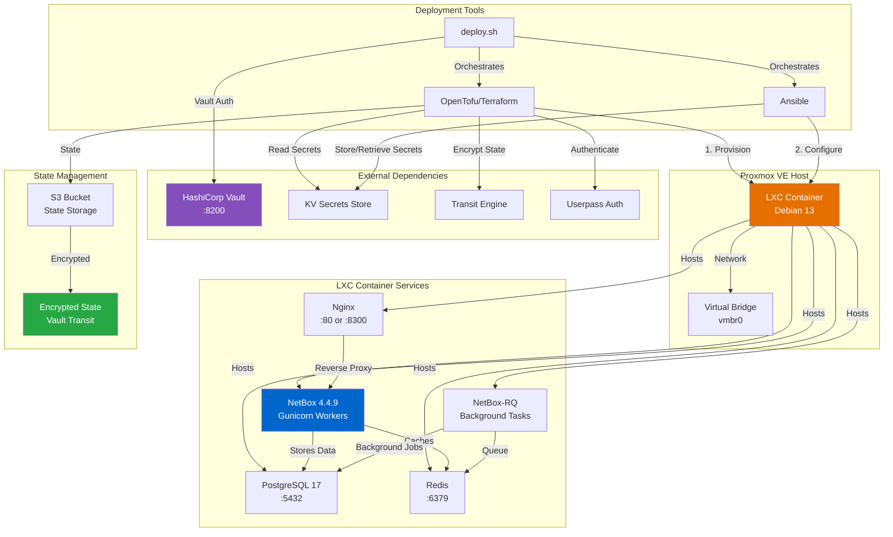
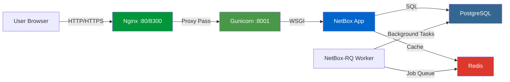
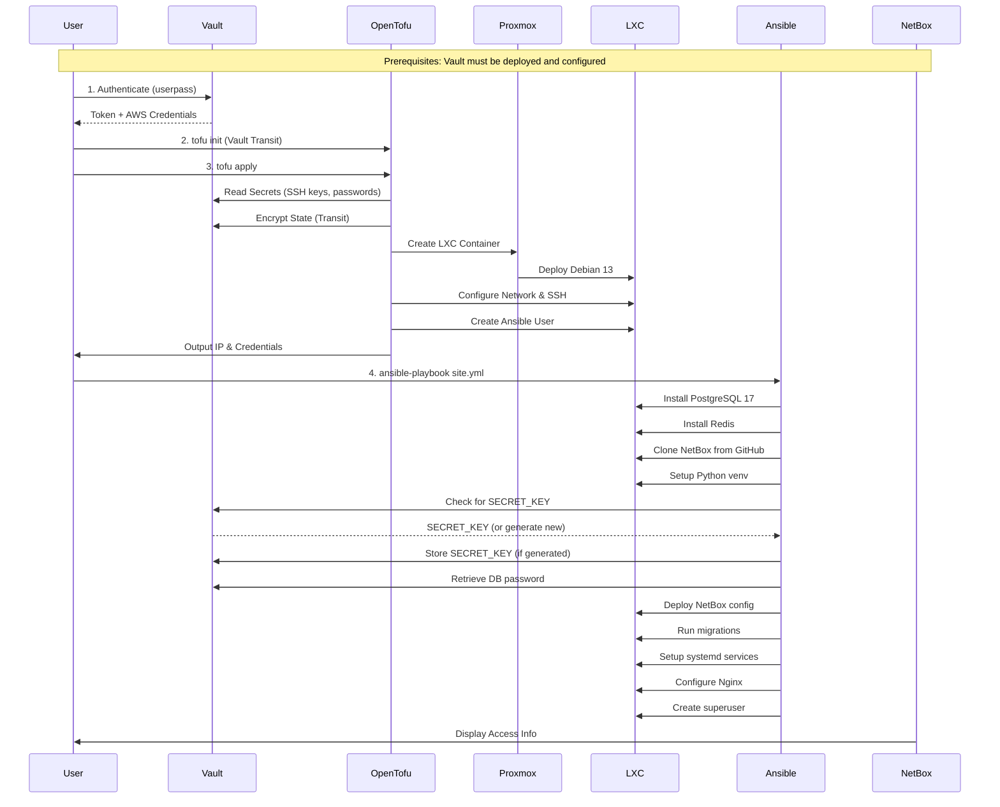
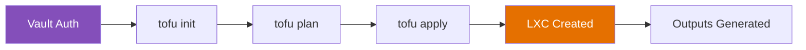

# NetBox DCIM/IPAM LXC Container Deployment

[](https://opentofu.org/)
[](https://www.ansible.com/)
[](https://www.proxmox.com/)
[](https://www.vaultproject.io/)
[](LICENSE)

Automated deployment of NetBox Data Center Infrastructure Management (DCIM) and IP Address Management (IPAM) platform in a Proxmox LXC container using Infrastructure as Code (IaC) principles. This project combines OpenTofu (Terraform) for infrastructure provisioning, Ansible for configuration management, and HashiCorp Vault for secrets management.

## 📋 Table of Contents

- [Overview](#overview)
- [Architecture](#architecture)
- [Features](#features)
- [Prerequisites](#prerequisites)
  - [Required: HashiCorp Vault](#required-hashicorp-vault)
- [Quick Start](#quick-start)
  - [Automated Deployment (Recommended)](#automated-deployment-recommended)
  - [Manual Deployment (Advanced)](#manual-deployment-advanced)
- [Deployment Script Reference](#-deployment-script-reference)
- [Project Structure](#project-structure)
- [Deployment Workflow](#deployment-workflow)
- [Configuration](#configuration)
- [Vault Integration](#vault-integration)
- [Security Considerations](#security-considerations)
- [Troubleshooting](#troubleshooting)
- [Maintenance](#maintenance)
- [Contributing](#contributing)
- [License](#license)

> 📖 **Detailed Deployment Guide**: See [DEPLOYMENT.md](DEPLOYMENT.md) for comprehensive documentation on the automated deployment script and Vault setup.
>
> ⚠️ **Deployment Order**: This project requires [lxc_vault](../lxc_vault/README.md) to be deployed first. See the [root README](../README.md) for the complete deployment order.

## 🔍 Overview

This project automates the complete deployment lifecycle of NetBox DCIM/IPAM platform in a lightweight LXC container on Proxmox VE. NetBox is the premier open-source solution for network infrastructure documentation and IP address management, used by thousands of organizations worldwide.

### What is NetBox?

NetBox is a web-based application designed to help network engineers and infrastructure teams:

- **Document Network Infrastructure**: Racks, devices, cables, power connections
- **Manage IP Addresses**: IP networks, prefixes, addresses, VLANs, VRFs
- **Track Circuits**: Internet connections, point-to-point links, providers
- **Organize Sites**: Locations, regions, tenants, contacts
- **Integrate with Automation**: REST API, GraphQL, webhooks, custom scripts

### This Project Provides

- **Infrastructure Provisioning**: OpenTofu/Terraform creates and configures the LXC container
- **Multi-Service Stack**: PostgreSQL, Redis, NetBox, Nginx reverse proxy
- **Vault Integration**: All secrets managed through HashiCorp Vault
- **State Encryption**: Vault Transit engine for Terraform state files
- **Automated Configuration**: Ansible deploys and configures entire stack
- **Secret Generation**: Automatic SECRET_KEY generation and storage in Vault
- **Production Ready**: Systemd services, Nginx proxy, supervisor account

### Why LXC?

LXC containers provide a lightweight alternative to full VMs while maintaining isolation:

- **Performance**: Near-native performance with minimal overhead
- **Resource Efficiency**: Uses ~500MB RAM for full stack vs 2GB+ for VMs
- **Fast Deployment**: Container creation takes seconds
- **Easy Backup**: Proxmox snapshot and backup integration

## 🏗️ Architecture



### Service Architecture



### Deployment Flow



## ✨ Features

### Infrastructure (OpenTofu/Terraform)

- ✅ **Automated LXC Container Provisioning** on Proxmox VE
- ✅ **Vault Integration** for all secrets (SSH keys, passwords, tokens)
- ✅ **Vault Transit Encryption** for Terraform state files
- ✅ **Ephemeral Resources** for write-only secrets in provisioners
- ✅ **S3 Remote State Backend** with locking
- ✅ **Flexible Resource Allocation** (CPU, RAM, Disk)
- ✅ **Network Configuration** (Static IP or DHCP)
- ✅ **SSH Key Authentication** from Vault
- ✅ **Mount Point Support** for ZFS/LVM volumes
- ✅ **Comprehensive Variable Validation**

### Configuration (Ansible)

- ✅ **Multi-Service Stack Deployment**
  - PostgreSQL 17 (database backend)
  - Redis 7 (caching and task queue)
  - NetBox 4.4.9 (application)
  - Gunicorn (WSGI server)
  - NetBox-RQ (background worker)
  - Nginx (reverse proxy)
- ✅ **Vault Integration**
  - SECRET_KEY auto-generation and storage
  - Database password retrieval
  - Secure credential management
- ✅ **Python Virtual Environment** setup
- ✅ **Django Migrations** automated
- ✅ **Systemd Services** configured and enabled
- ✅ **Nginx Reverse Proxy** with port detection (80 or 8300)
- ✅ **Superuser Account** creation
- ✅ **Idempotent Playbooks** (safe to re-run)
- ✅ **Role-Based Organization** for maintainability

### Security

- 🔒 **Unprivileged Containers** (default)
- 🔒 **Vault-Managed Secrets** (no plain text credentials)
- 🔒 **State File Encryption** (Vault Transit Engine)
- 🔒 **SSH Key-Only Authentication**
- 🔒 **Database Password Security** (generated and stored in Vault)
- 🔒 **Django SECRET_KEY Management** (auto-generated, never exposed)
- 🔒 **Systemd Security Hardening** (ProtectSystem, PrivateTmp, NoNewPrivileges)
- 🔒 **Comprehensive .gitignore** to prevent credential leaks

### Vault Features

- 🔐 **KV Secrets Storage** - NetBox credentials stored in Vault KV v2
- 🔐 **Transit Encryption** - State files encrypted by Vault Transit engine
- 🔐 **Userpass Authentication** - Secure authentication for Terraform
- 🔐 **Dynamic Credentials** - AWS credentials generated on-demand
- 🔐 **Secret Rotation** - Supports credential rotation without code changes
- 🔐 **Audit Trail** - All secret access logged in Vault

## 📦 Prerequisites

### Required: HashiCorp Vault

**⚠️ CRITICAL**: This project requires a working HashiCorp Vault installation. You must deploy [lxc_vault](../lxc_vault/README.md) first.

See the [root README](../README.md) for the complete deployment order and dependencies.

#### Vault Requirements

1. **Vault Service Running**
   - Accessible at configured URL (e.g., `https://vault.example.com:8200`)
   - Initialized and unsealed
   - Network connectivity from your workstation

2. **Transit Engine Enabled**

   ```bash
   vault secrets enable transit
   vault write -f transit/keys/terraform-state-encryption
   ```

3. **KV v2 Secrets Engine**

   ```bash
   vault secrets enable -path=secrets kv-v2
   ```

4. **Required Secrets Stored** (see [DEPLOYMENT.md](DEPLOYMENT.md) for details)
   - Proxmox API credentials
   - SSH public keys for root and ansible users
   - NetBox database password
   - Proxmox node name

5. **Userpass Authentication Configured**

   ```bash
   vault auth enable userpass
   vault write auth/userpass/users/terraform password="..." policies="terraform"
   ```

6. **Vault Policy Created** (see [vault_policy.hcl.example](terraform/vault_policy.hcl.example))
   - Read access to KV secrets
   - Read/write access to Transit engine
   - AWS credentials generation (if using S3 backend)

For complete Vault setup instructions, see [DEPLOYMENT.md](DEPLOYMENT.md#vault-setup).

### Required Software

| Tool | Version | Purpose |
| ---- | ------- | ------- |
| **Proxmox VE** | 8.x+ | Hypervisor platform |
| **OpenTofu** | 1.8+ | Infrastructure provisioning (or Terraform 1.7+) |
| **Ansible** | 2.15+ | Configuration management |
| **Python** | 3.9+ | Ansible runtime |
| **SSH Client** | Any | Remote access |
| **vault CLI** | 1.13+ | Vault authentication |
| **jq** | 1.6+ | JSON processing for deployment script |

### Proxmox Configuration

1. **LXC Template Downloaded**

   ```bash
   # On Proxmox host
   pveam update
   pveam download local debian-13-standard_13.1-2_amd64.tar.zst
   ```

2. **Network Bridge Available**
   - Default: `vmbr0` (configured during Proxmox installation)
   - Verify: `ip link show vmbr0`

### AWS/S3 Configuration (Optional)

For remote state storage:

1. **S3 Bucket Created**
   - Enable versioning
   - Enable encryption (AES-256 or KMS)
   - Block public access

2. **Vault AWS Secrets Engine** (recommended) OR **AWS Credentials Configured**

   Option A: Vault AWS Engine (recommended)

   ```bash
   vault secrets enable aws
   vault write aws/config/root \
     access_key=... \
     secret_key=... \
     region=us-east-1
   vault write aws/roles/terraform \
     credential_type=iam_user \
     policy_document=@aws-policy.json
   ```

   Option B: Direct AWS Credentials

   ```bash
   aws configure --profile tofu-aws-profile
   ```

3. **IAM Permissions Required**
   - `s3:ListBucket`
   - `s3:GetObject`
   - `s3:PutObject`
   - `s3:DeleteObject`

## 🚀 Quick Start

### Before You Begin

1. **Deploy HashiCorp Vault first**: See [lxc_vault](../lxc_vault/README.md)
2. **Configure Vault**: Set up Transit engine, KV secrets, and authentication
3. **Review**: Read [DEPLOYMENT.md](DEPLOYMENT.md) for detailed Vault setup

### Automated Deployment (Recommended)

The `deploy.sh` script automates the entire deployment process with pre-flight checks, Vault authentication, and comprehensive error handling.

```bash
# 1. Prepare configuration files
cp terraform/terraform.tfvars.example terraform/terraform.tfvars
cp terraform/s3.backend.config.template terraform/s3.backend.config
cp ansible/inventory.yml.example ansible/inventory.yml

# 2. Edit configuration files
nano terraform/terraform.tfvars        # Configure your values
nano terraform/s3.backend.config       # S3 backend (or use local)
nano ansible/inventory.yml             # Ansible inventory

# 3. Run deployment script (interactive mode)
./deploy.sh

# OR use command-line mode for automation
./deploy.sh deploy
```

The script will:

- ✅ Validate all prerequisites (binaries, Vault, files)
- ✅ Authenticate with Vault (userpass)
- ✅ Generate dynamic AWS credentials (if needed)
- ✅ Initialize Terraform with Vault Transit encryption
- ✅ Deploy infrastructure
- ✅ Generate Ansible inventory automatically
- ✅ Test connectivity
- ✅ Deploy and configure all services
- ✅ Display access information

### Manual Deployment (Advanced)

For experienced users or custom workflows:

#### 1. Prepare Configuration

```bash
# Copy example files
cp terraform/terraform.tfvars.example terraform/terraform.tfvars
cp terraform/s3.backend.config.template terraform/s3.backend.config
cp terraform/vault_init.sh.example terraform/vault_init.sh
cp ansible/inventory.yml.example ansible/inventory.yml

# Edit with your values
nano terraform/terraform.tfvars
nano terraform/s3.backend.config
nano terraform/vault_init.sh
```

#### 2. Authenticate with Vault

```bash
cd terraform

# Option A: Use vault_init.sh helper script
chmod +x vault_init.sh
source ./vault_init.sh

# Option B: Manual Vault authentication
export VAULT_ADDR='https://vault.example.com:8200'
vault login -method=userpass username=terraform
# Enter password when prompted
```

#### 3. Deploy Infrastructure

```bash
# Initialize Terraform with Vault Transit encryption
tofu init -backend-config=s3.backend.config

# Review changes
tofu plan

# Apply infrastructure
tofu apply

# Save outputs for Ansible
tofu output -json > outputs.json
LXC_IP=$(tofu output -raw lxc_ip_address)
echo "Container IP: $LXC_IP"
```

#### 4. Configure Services with Ansible

```bash
cd ../ansible

# Update inventory with container IP
nano inventory.yml
# Set ansible_host to the IP from terraform output

# Test connectivity
ansible netbox -m ping

# Deploy NetBox stack
ansible-playbook site.yml
```

#### 5. Access NetBox

```bash
# Get access information
tofu output netbox_url
tofu output netbox_admin_user

# Retrieve admin password from Vault
vault kv get -field=django_superuser_password secrets/proxmox/netbox

# Open NetBox UI in browser
# Example: http://203.0.113.60:80 or http://203.0.113.60:8300
```

#### 6. Post-Deployment

```bash
# Verify all services are running
ssh ansible@<container-ip> sudo systemctl status postgresql
ssh ansible@<container-ip> sudo systemctl status redis-server
ssh ansible@<container-ip> sudo systemctl status netbox
ssh ansible@<container-ip> sudo systemctl status netbox-rq
ssh ansible@<container-ip> sudo systemctl status nginx

# Check NetBox version
ssh ansible@<container-ip> /opt/netbox/venv/bin/python /opt/netbox/netbox/manage.py version
```

## 🤖 Deployment Script Reference

### Features

The `deploy.sh` script provides enterprise-grade automation with:

**Pre-flight Checks:**

- Binary validation (tofu/terraform, ansible, ssh, vault, jq)
- Vault connectivity and authentication testing
- Directory structure validation
- Configuration file checks (terraform.tfvars, s3.backend.config)

**Vault Integration:**

- Automatic Vault userpass authentication
- Dynamic AWS credentials generation via Vault
- VAULT_TOKEN passed via environment (secure, not in logs)
- Environment variable management

**Environment Management:**

- Interactive prompts for missing variables
- Support for Vault-based credentials
- Automatic credential detection and loading

**Deployment Workflow:**

- Vault authentication and credential setup
- Terraform initialization (S3 backend with Vault Transit encryption)
- Configuration validation
- Infrastructure planning and deployment
- Automatic Ansible inventory generation
- Connectivity testing with retries
- Multi-service configuration deployment
- Service health verification

**Safety Features:**

- Confirmation prompts for destructive operations
- Double confirmation for infrastructure destruction
- Comprehensive logging to `logs/` directory
- Color-coded output (success/warning/error)
- Detailed error messages with recovery instructions

### Usage Examples

**Interactive Menu:**

```bash
# Launch interactive menu
./deploy.sh
```

**Command-Line Mode:**

```bash
# Full deployment (Vault + Terraform + Ansible)
./deploy.sh deploy

# Dry-run - plan without applying changes
./deploy.sh plan

# Check current deployment status
./deploy.sh status

# Destroy infrastructure (requires confirmation)
./deploy.sh destroy

# Run only Ansible (requires VAULT_TOKEN)
export VAULT_TOKEN=$(vault print token)
./deploy.sh ansible

# Show help
./deploy.sh help
```

### Environment Variables

The script supports environment variables for automation:

**Vault Authentication:**

```bash
export VAULT_ADDR='https://vault.example.com:8200'
export VAULT_USERNAME='terraform'
# Password is prompted interactively (not stored in environment)
```

**Standalone Ansible Execution:**

```bash
# Set VAULT_TOKEN for Ansible-only runs
export VAULT_TOKEN=$(vault print token)
./deploy.sh ansible
```

**Optional (can be set in terraform.tfvars):**

```bash
export TF_VAR_proxmox_endpoint="https://192.0.2.100:8006"
export TF_VAR_lxc_ip_address="203.0.113.60/24"
export TF_VAR_lxc_gateway="203.0.113.1"
```

### Logging

All deployment activities are logged to timestamped files:

```bash
# Log location
logs/deployment_YYYYMMDD_HHMMSS.log

# View recent logs
tail -f logs/deployment_*.log

# Search logs
grep ERROR logs/deployment_*.log

# Cleanup old logs (manual)
# See logs/README.md for retention recommendations
```

### Error Handling

The script provides clear error messages and recovery instructions:

**Vault Connection Failures:**

- Vault URL and authentication troubleshooting
- Manual vault login commands provided
- Network connectivity checks

**Terraform Failures:**

- Infrastructure left in place for debugging
- Manual cleanup instructions provided
- State file location displayed

**Ansible Failures:**

- Infrastructure remains deployed
- Manual playbook execution commands provided
- Service-specific troubleshooting steps

**Partial Deployments:**

- Clear indication of what succeeded
- Instructions for completing deployment
- Option to retry or rollback

## 📁 Project Structure

```text
lxc_netbox/
├── README.md                         # This file
├── DEPLOYMENT.md                     # Detailed deployment guide
├── QUICKREF.sh                       # Quick reference commands
├── deploy.sh                         # Main deployment script (~280 lines)
├── .gitignore                        # Git ignore patterns
├── vault_policy.hcl.example          # Required Vault policy example
│
├── scripts/                          # Modular script components
│   ├── common.sh                     # Logging, colors, utilities
│   ├── vault.sh                      # Vault authentication & AWS credentials
│   ├── terraform.sh                  # Terraform/OpenTofu operations
│   ├── ansible.sh                    # Ansible inventory & deployment
│   └── setup_ansible_user.sh         # Ansible user bootstrapping
│
├── logs/                             # Deployment logs
│   └── README.md                     # Log management guide
│
├── terraform/                        # Infrastructure provisioning
│   ├── README.md                     # Terraform documentation
│   ├── main.tf                       # LXC container resource
│   ├── variables.tf                  # Variable definitions
│   ├── outputs.tf                    # Output values
│   ├── providers.tf                  # Provider configurations
│   ├── backend.tf                    # S3 backend configuration
│   ├── encryption.tf                 # Vault Transit encryption
│   ├── terraform.tfvars.example      # Example variables
│   └── s3.backend.config.template    # Example backend config
│
└── ansible/                          # Configuration management
    ├── site.yml                      # Main playbook
    ├── ansible.cfg                   # Ansible configuration
    ├── inventory.yml.example         # Example inventory
    └── roles/                        # Ansible roles
        ├── postgresql/               # PostgreSQL 17 installation
        ├── redis/                    # Redis cache server
        ├── netbox/                   # NetBox application
        ├── systemd/                  # Systemd services
        ├── nginx/                    # Nginx reverse proxy
        └── superuser/                # Django admin user
```

## 🔄 Deployment Workflow

### Phase 1: Prerequisites (Before This Project)

1. **Deploy lxc_vault** - See [lxc_vault/README.md](../lxc_vault/README.md)
2. **Initialize Vault** - Unseal and get root token
3. **Enable Transit Engine** - For state encryption
4. **Enable KV v2 Engine** - For secret storage
5. **Enable Userpass Auth** - For Terraform authentication
6. **Store Required Secrets** - See [DEPLOYMENT.md](DEPLOYMENT.md)
7. **Create Vault Policy** - See [vault_policy.hcl.example](terraform/vault_policy.hcl.example)

### Phase 2: Terraform (Infrastructure)



1. **Authentication**: Login to Vault with userpass
2. **Initialization**: Initialize Terraform with Vault Transit encryption
3. **Planning**: Review infrastructure changes
4. **Provisioning**: Create LXC container with Proxmox
5. **Configuration**: Set up SSH, create ansible user
6. **Outputs**: Retrieve container IP and credentials

### Phase 3: Ansible (Configuration)


1. **PostgreSQL**: Install and configure PostgreSQL 17
2. **Redis**: Install and configure Redis 7
3. **NetBox**: Clone from GitHub, setup Python venv
4. **Secrets**: Check/generate SECRET_KEY, retrieve DB password from Vault
5. **Configuration**: Deploy configuration files
6. **Database**: Run Django migrations
7. **Services**: Configure systemd services (netbox, netbox-rq)
8. **Nginx**: Configure reverse proxy with port detection
9. **Superuser**: Create Django admin account

### Phase 4: Verification

1. **Service Status**: Check all systemd services
2. **Web Access**: Test NetBox UI access
3. **Login**: Verify superuser credentials
4. **API Test**: Test REST API endpoint
5. **Database**: Verify PostgreSQL connectivity

## ⚙️ Configuration

### Terraform Variables

Key variables in `terraform.tfvars`:

```hcl
# Proxmox Connection (stored in Vault)
proxmox_endpoint = "https://192.0.2.100:8006"

# LXC Container Configuration
lxc_id          = 201
lxc_description = "NetBox DCIM/IPAM Platform"
lxc_ip_address  = "203.0.113.60/24"
lxc_gateway     = "203.0.113.1"

# Resources
lxc_cpu_cores   = 2
lxc_memory      = 2048  # 2GB RAM recommended
lxc_disk_size   = 20    # 20GB disk

# Network
lxc_hostname    = "netbox"
lxc_domain      = "example.com"

# Vault Configuration
vault_address              = "https://vault.example.com:8200"
vault_username             = "terraform"
transit_engine_path        = "transit"
transit_key_name           = "terraform-state-encryption"
ephemeral_vault_mount_path = "secrets"

# Vault Secret Paths
proxmox_api_token_vault_path = "proxmox/api_token"
root_ssh_public_key_path     = "proxmox/ssh_keys/root_public"
ansible_ssh_public_key_path  = "proxmox/ssh_keys/ansible_public"
proxmox_node_name_path       = "proxmox/node_name"
```

See [terraform/terraform.tfvars.example](terraform/terraform.tfvars.example) for all available options.

### Ansible Variables

Key variables in `ansible/site.yml`:

```yaml
# Vault configuration
vault_addr: "https://vault.example.com:8200"
vault_kv_path: "secrets/proxmox/data/netbox"

# NetBox configuration
netbox_version: "v4.4.9"
netbox_install_dir: "/opt/netbox"
netbox_allowed_hosts:
  - "netbox.example.com"

# Database configuration
postgres_version: "17"
netbox_db_name: "netbox"
netbox_db_user: "netbox"

# Django superuser
django_superuser_username: "admin"
django_superuser_email: "admin@example.com"
```

## 🔐 Vault Integration

This project heavily integrates with HashiCorp Vault for security:

### Secret Paths

Terraform reads these secrets from Vault KV:

| Secret Path | Purpose | Example Value |
| ------------- | --------- | --------------- |
| `proxmox/api_token` | Proxmox API authentication | `user@pam!token=xxxx` |
| `proxmox/ssh_keys/root_public` | Root SSH public key | `ssh-ed25519 AAAA...` |
| `proxmox/ssh_keys/ansible_public` | Ansible SSH public key | `ssh-ed25519 AAAA...` |
| `proxmox/node_name` | Proxmox node name | `pve` or `pve-node1` |
| `proxmox/netbox/db_password` | PostgreSQL password | `generated-password` |

### Ansible Vault Interaction

Ansible performs these Vault operations:

1. **Check SECRET_KEY**: Check if NetBox SECRET_KEY exists in Vault
2. **Generate if Missing**: Generate new SECRET_KEY if not found
3. **Store in Vault**: Save generated SECRET_KEY to Vault KV
4. **Retrieve DB Password**: Get PostgreSQL password from Vault
5. **Deploy Configuration**: Use secrets in NetBox configuration

### State Encryption

Terraform state is encrypted using Vault Transit engine:

```hcl
# encryption.tf
key_provider "openbao" "vault_transit" {
  address = var.vault_address
  transit_engine_path = var.transit_engine_path
  key_name = var.transit_key_name
  key_length = 32
}

method "aes_gcm" "vault_method" {
  keys = key_provider.openbao.vault_transit
}

state {
  method = method.aes_gcm.vault_method
  enforced = true
}
```

**Benefits:**

- Keys never leave Vault
- Centralized key management
- Automatic key rotation support
- Full audit trail
- Compliance-ready (FIPS 140-2)

### Required Vault Policy

See [terraform/vault_policy.hcl.example](terraform/vault_policy.hcl.example) for the complete policy.

Minimum permissions required:

```hcl
# Read KV secrets
path "secrets/data/proxmox/*" {
  capabilities = ["read"]
}

# Encrypt/decrypt state with Transit
path "transit/encrypt/terraform-state-encryption" {
  capabilities = ["update"]
}
path "transit/decrypt/terraform-state-encryption" {
  capabilities = ["update"]
}

# Generate AWS credentials (if using S3)
path "aws/creds/terraform" {
  capabilities = ["read"]
}
```

### Vault Setup Checklist

Before deploying:

- [ ] Vault deployed and accessible
- [ ] Transit engine enabled: `vault secrets enable transit`
- [ ] Encryption key created: `vault write -f transit/keys/terraform-state-encryption`
- [ ] KV v2 engine enabled: `vault secrets enable -path=secrets kv-v2`
- [ ] Required secrets stored in Vault KV
- [ ] Userpass auth enabled: `vault auth enable userpass`
- [ ] Terraform user created: `vault write auth/userpass/users/terraform password=...`
- [ ] Policy created and attached to user

See [DEPLOYMENT.md](DEPLOYMENT.md) for detailed setup instructions.

## 🔒 Security Considerations

### Secrets Management

1. **Never Commit Secrets**: All sensitive files are in .gitignore
2. **Use Vault for Everything**: All credentials managed through Vault
3. **Rotate Credentials**: Regularly rotate passwords and keys
4. **Audit Access**: Review Vault audit logs regularly
5. **Least Privilege**: Grant minimum required Vault permissions

### Network Security

1. **Firewall Rules**: Limit access to necessary ports only
   - Port 80/8300: NetBox web interface
   - Port 5432: PostgreSQL (internal only)
   - Port 6379: Redis (internal only)

2. **HTTPS/TLS**: Use reverse proxy with TLS for production
   - Nginx proxy on Proxmox host
   - Let's Encrypt certificates
   - HSTS headers

3. **VPN/Bastion**: Use VPN or bastion host for remote access

### Container Security

1. **Unprivileged Container**: Default configuration uses unprivileged LXC
2. **AppArmor**: Enabled by default on Debian
3. **Security Updates**: Regularly update packages
4. **Monitoring**: Monitor container resource usage and logs

### Database Security

1. **Password Complexity**: Strong passwords generated and stored in Vault
2. **Network Isolation**: PostgreSQL only accessible from localhost
3. **Backups**: Regular encrypted backups
4. **SSL Connections**: Configure SSL for PostgreSQL in production

### Application Security

1. **Django Security**: SECRET_KEY stored securely in Vault
2. **ALLOWED_HOSTS**: Configured with specific domains
3. **CSRF Protection**: CSRF_TRUSTED_ORIGINS configured
4. **Admin Panel**: Strong superuser password
5. **Security Headers**: Configured in Nginx

### Best Practices

#### ✅ Recommended Practices

1. **Vault Authentication**:
   - Use strong passwords for Vault userpass
   - Enable MFA for Vault access
   - Rotate Vault tokens regularly

2. **Backup Strategy**:
   - Daily PostgreSQL dumps to secure location
   - Proxmox LXC snapshots before changes
   - Vault backup for secrets

3. **Monitoring**:
   - Watch Vault audit logs
   - Monitor service status (systemd)
   - Alert on failed login attempts
   - Track resource usage

4. **Updates**:
   - Security updates applied within 48 hours
   - Test updates in non-production first
   - Maintain deployment documentation

#### 🚫 What NOT to Do

- ❌ Don't commit terraform.tfvars or inventory.yml
- ❌ Don't expose Vault without authentication
- ❌ Don't use weak passwords
- ❌ Don't run as privileged container (unless required)
- ❌ Don't expose PostgreSQL to external network
- ❌ Don't skip backups

## 🔧 Troubleshooting

### Common Issues

#### 1. Vault Connection Errors

**Symptom**: `Error: Failed to read from Vault`

**Solutions**:

```bash
# Check Vault connectivity
curl -k $VAULT_ADDR/v1/sys/health

# Verify Vault token is valid
vault token lookup

# Re-authenticate
vault login -method=userpass username=terraform

# Check secret paths
vault kv list secrets/proxmox
vault kv get secrets/proxmox/api_token
```

#### 2. Terraform State Encryption Errors

**Symptom**: `Error: Failed to encrypt state`

**Solutions**:

```bash
# Verify Transit engine is enabled
vault secrets list

# Check encryption key exists
vault list transit/keys
vault read transit/keys/terraform-state-encryption

# Test encryption
echo "test" | base64 | vault write transit/encrypt/terraform-state-encryption plaintext=-

# Verify policy permissions
vault policy read terraform
```

#### 3. Container Creation Fails

**Symptom**: `Error creating container`

**Solutions**:

```bash
# Check Proxmox API connectivity
curl -k https://proxmox-host:8006/api2/json/version

# Verify template exists
ssh root@proxmox-host pveam list local | grep debian-13

# Check available resources
ssh root@proxmox-host pvesh get /nodes/pve/status

# Verify network bridge exists
ssh root@proxmox-host ip link show vmbr0
```

#### 4. Ansible Connection Failures

**Symptom**: `Failed to connect to the host via ssh`

**Solutions**:

```bash
# Wait for container to finish booting (60 seconds)
sleep 60

# Test SSH connectivity
ssh -v ansible@<container-ip>

# Check SSH key
ssh-add -l

# Verify container is running
ssh root@proxmox-host pct list | grep <vmid>
ssh root@proxmox-host pct status <vmid>

# Check container logs
ssh root@proxmox-host pct enter <vmid>
```

#### 5. PostgreSQL Service Failures

**Symptom**: `postgresql.service failed`

**Solutions**:

```bash
# SSH to container
ssh ansible@<container-ip>

# Check PostgreSQL status
sudo systemctl status postgresql

# View PostgreSQL logs
sudo journalctl -u postgresql -n 50

# Check disk space
df -h

# Verify PostgreSQL is listening
sudo ss -tlnp | grep 5432

# Test PostgreSQL connection
sudo -u postgres psql -c "SELECT version();"
```

#### 6. NetBox Service Won't Start

**Symptom**: `netbox.service failed to start`

**Solutions**:

```bash
# SSH to container
ssh ansible@<container-ip>

# Check NetBox service
sudo systemctl status netbox
sudo systemctl status netbox-rq

# View NetBox logs
sudo journalctl -u netbox -n 100
sudo journalctl -u netbox-rq -n 100

# Check configuration
sudo -u netbox /opt/netbox/venv/bin/python /opt/netbox/netbox/manage.py check

# Test Gunicorn manually
sudo -u netbox /opt/netbox/venv/bin/gunicorn --config /opt/netbox/gunicorn.py netbox.wsgi

# Verify database connectivity
sudo -u netbox /opt/netbox/venv/bin/python /opt/netbox/netbox/manage.py dbshell
```

#### 7. Nginx Won't Start or Port Conflict

**Symptom**: `nginx: [emerg] bind() to 0.0.0.0:80 failed`

**Solutions**:

```bash
# Check what's using port 80
sudo ss -tlnp | grep :80

# Nginx will automatically fallback to port 8300 if 80 is in use
sudo systemctl status nginx

# Check Nginx configuration
sudo nginx -t

# View Nginx logs
sudo journalctl -u nginx -n 50
tail -f /var/log/nginx/error.log

# Access NetBox on alternate port
curl http://<container-ip>:8300
```

#### 8. Can't Access NetBox Web Interface

**Symptom**: Browser shows "Connection refused" or "502 Bad Gateway"

**Solutions**:

```bash
# Verify all services are running
ssh ansible@<container-ip> sudo systemctl status netbox
ssh ansible@<container-ip> sudo systemctl status netbox-rq
ssh ansible@<container-ip> sudo systemctl status nginx
ssh ansible@<container-ip> sudo systemctl status postgresql
ssh ansible@<container-ip> sudo systemctl status redis-server

# Check which port Nginx is using
ssh ansible@<container-ip> sudo ss -tlnp | grep nginx

# Test NetBox directly (bypass Nginx)
curl http://<container-ip>:8001

# Check Nginx proxy configuration
ssh ansible@<container-ip> sudo cat /etc/nginx/sites-enabled/netbox

# View access logs
ssh ansible@<container-ip> sudo tail -f /var/log/nginx/access.log
```

#### 9. Vault Secrets Not Found

**Symptom**: Ansible reports secrets not found in Vault

**Solutions**:

```bash
# List available secrets
vault kv list secrets/proxmox

# Check specific secret
vault kv get secrets/proxmox/netbox

# Manually create missing secret
vault kv put secrets/proxmox/netbox/secret_key value="$(openssl rand -base64 32)"

# Verify Ansible can access Vault
ansible netbox -m shell -a "curl -s $VAULT_ADDR/v1/sys/health"
```

### Debug Mode

#### Terraform/OpenTofu Debug

```bash
export TF_LOG=DEBUG
export TF_LOG_PATH=./terraform-debug.log
tofu apply
```

#### Ansible Debug

```bash
ansible-playbook site.yml -vvv
```

#### Vault Debug

```bash
export VAULT_LOG_LEVEL=debug
vault kv get secrets/proxmox/api_token
```

### Getting Help

1. **Check Logs**:
   - Deployment: `logs/deployment_*.log`
   - Terraform: `.terraform/terraform.log`
   - Services: `sudo journalctl -u <service-name> -f`
   - Nginx: `/var/log/nginx/error.log`
   - NetBox: `sudo journalctl -u netbox -f`

2. **Validate Configuration**:

   ```bash
   # Terraform
   tofu validate
   tofu plan
   
   # Ansible
   ansible-playbook site.yml --syntax-check
   ansible-lint site.yml
   
   # NetBox
   sudo -u netbox /opt/netbox/venv/bin/python /opt/netbox/netbox/manage.py check
   ```

3. **Community Resources**:
   - [NetBox Documentation](https://docs.netbox.dev/)
   - [NetBox GitHub Issues](https://github.com/netbox-community/netbox/issues)
   - [HashiCorp Vault Docs](https://developer.hashicorp.com/vault/docs)
   - [OpenTofu Docs](https://opentofu.org/docs/)
   - [Proxmox Forums](https://forum.proxmox.com/)

## 🔄 Maintenance

### Regular Tasks

#### Update NetBox

```bash
# SSH to container
ssh ansible@<container-ip>

# Become netbox user
sudo -u netbox -s

# Navigate to install directory
cd /opt/netbox

# Check current version
./venv/bin/python netbox/manage.py version

# Update to latest version
cd /opt
sudo git clone --depth 1 --branch v4.5.0 https://github.com/netbox-community/netbox.git netbox-new
sudo cp -r /opt/netbox/netbox/media /opt/netbox-new/netbox/
sudo cp /opt/netbox/netbox/netbox/configuration.py /opt/netbox-new/netbox/netbox/
sudo mv /opt/netbox /opt/netbox-old
sudo mv /opt/netbox-new /opt/netbox
cd /opt/netbox
sudo ./upgrade.sh

# Restart services
sudo systemctl restart netbox netbox-rq

# Verify
./venv/bin/python netbox/manage.py version
```

See [NetBox Upgrade Guide](https://docs.netbox.dev/en/stable/installation/upgrading/) for detailed instructions.

#### Update Container Packages

```bash
# SSH to container
ssh ansible@<container-ip>

# Update package lists
sudo apt update

# Upgrade packages
sudo apt upgrade -y

# Clean old packages
sudo apt autoremove -y
sudo apt autoclean

# Reboot if needed
sudo reboot
```

#### Backup NetBox Data

```bash
# PostgreSQL database backup
ssh ansible@<container-ip> sudo -u postgres pg_dump netbox > netbox_backup_$(date +%Y%m%d).sql

# Or use Proxmox snapshot (recommended)
ssh root@proxmox-host pct snapshot <vmid> netbox-backup-$(date +%Y%m%d)

# Backup media files
ssh ansible@<container-ip> sudo tar -czf /tmp/netbox-media.tar.gz /opt/netbox/netbox/media
scp ansible@<container-ip>:/tmp/netbox-media.tar.gz ./backups/

# Backup configuration
ssh ansible@<container-ip> sudo cat /opt/netbox/netbox/netbox/configuration.py > netbox-config-backup.py
```

#### Monitor Services

```bash
# Check all NetBox services
ssh ansible@<container-ip> '
  sudo systemctl status postgresql | head -3
  sudo systemctl status redis-server | head -3
  sudo systemctl status netbox | head -3
  sudo systemctl status netbox-rq | head -3
  sudo systemctl status nginx | head -3
'

# Check resource usage
ssh ansible@<container-ip> '
  echo "=== CPU & Memory ==="
  top -bn1 | head -5
  echo ""
  echo "=== Disk Usage ==="
  df -h
  echo ""
  echo "=== Database Size ==="
  sudo -u postgres psql -c "SELECT pg_size_pretty(pg_database_size('"'netbox'"'));"
'
```

#### Rotate Credentials

```bash
# Rotate PostgreSQL password
NEW_PW=$(openssl rand -base64 32)
ssh ansible@<container-ip> sudo -u postgres psql -c "ALTER USER netbox PASSWORD '$NEW_PW';"
vault kv put secrets/proxmox/netbox/db_password value="$NEW_PW"

# Update NetBox configuration
ssh ansible@<container-ip> sudo nano /opt/netbox/netbox/netbox/configuration.py
# Update DATABASE password

# Restart NetBox
ssh ansible@<container-ip> sudo systemctl restart netbox netbox-rq

# Rotate SSH keys
ssh-keygen -t ed25519 -f ~/.ssh/ansible_new
# Update key in Vault
vault kv put secrets/proxmox/ssh_keys/ansible_public value="$(cat ~/.ssh/ansible_new.pub)"
# Re-run: tofu apply
```

### Monitoring

Recommended monitoring checks:

- ✅ All service status (postgresql, redis, netbox, netbox-rq, nginx)
- ✅ Container resource usage (CPU/RAM/Disk)
- ✅ Database size growth
- ✅ NetBox RQ job queue length
- ✅ Nginx access/error logs
- ✅ Failed login attempts
- ✅ Certificate expiration (if using HTTPS)

## 📚 Additional Documentation

- **[DEPLOYMENT.md](DEPLOYMENT.md)** - Comprehensive deployment guide with Vault setup
- **[QUICKREF.sh](QUICKREF.sh)** - Quick reference for common operations
- **[Terraform Documentation](terraform/README.md)** - Detailed Terraform configuration guide (if present)
- **[vault_policy.hcl.example](terraform/vault_policy.hcl.example)** - Required Vault policy
- **[Ansible Role Documentation](ansible/roles/)** - Individual role documentation
  - [PostgreSQL Role](ansible/roles/postgresql/README.md)
  - [Redis Role](ansible/roles/redis/README.md)
  - [NetBox Role](ansible/roles/netbox/README.md)
  - [Systemd Role](ansible/roles/systemd/README.md)
  - [Nginx Role](ansible/roles/nginx/README.md)
  - [Superuser Role](ansible/roles/superuser/README.md)

## 🤝 Contributing

Contributions are welcome! Please follow these guidelines:

1. Fork the repository
2. Create a feature branch (`git checkout -b feature/improvement`)
3. Make your changes with clear commit messages
4. Test thoroughly (Terraform validate, Ansible lint)
5. Update documentation if needed
6. Submit a pull request

## 📄 License

This project is licensed under the MIT License - see the LICENSE file for details.

## 🙏 Acknowledgments

- NetBox Community for the excellent DCIM/IPAM platform
- HashiCorp for Vault and Terraform/OpenTofu
- OpenTofu community
- Proxmox VE team
- Ansible community

## 📞 Support

For issues and questions:

- Check [DEPLOYMENT.md](DEPLOYMENT.md) for detailed setup instructions
- Review the Troubleshooting section in this document
- Check [NetBox Documentation](https://docs.netbox.dev/)
- Open an issue in the repository

---

**⚠️ Production Warning**: This configuration is designed for homelab/development use. For production deployments, implement additional security measures including TLS/HTTPS encryption, network segregation, proper access controls, regular security audits, comprehensive monitoring, and disaster recovery procedures.

**🔗 Deployment Dependencies**: This project requires [lxc_vault](../lxc_vault/README.md) to be deployed first. See the [root README](../README.md) for the complete infrastructure deployment order.

**Last Updated**: January 15, 2026
