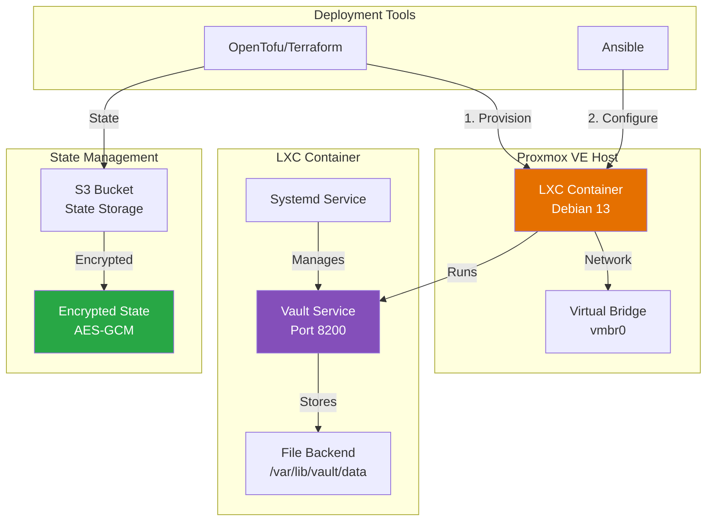
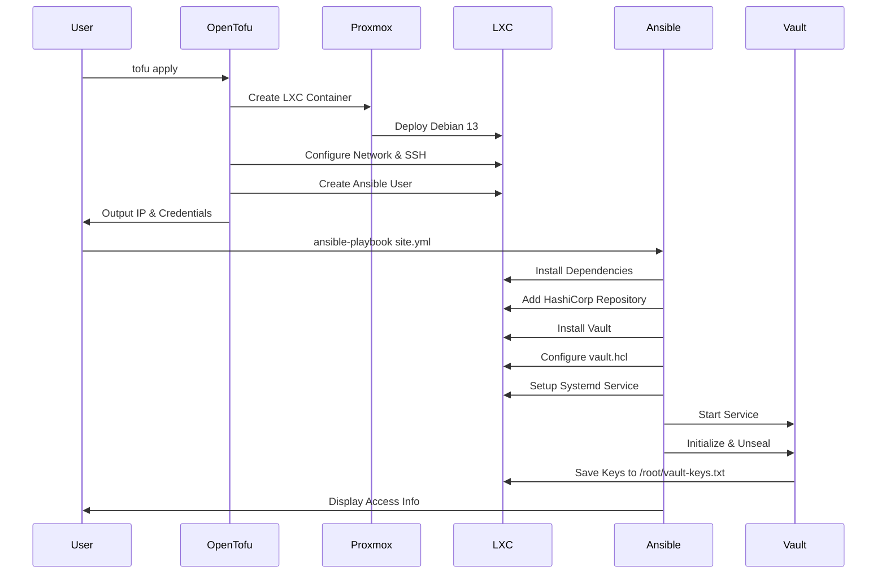

# HashiCorp Vault LXC Container Deployment

[](https://opentofu.org/)
[](https://www.ansible.com/)
[](https://www.proxmox.com/)
[](LICENSE)

Automated deployment of HashiCorp Vault secrets management server in a Proxmox LXC container using Infrastructure as Code (IaC) principles. This project combines OpenTofu (Terraform) for infrastructure provisioning and Ansible for configuration management.

## 📋 Table of Contents

- [Overview](#overview)
- [Architecture](#architecture)
- [Features](#features)
- [Authentication Requirements](#authentication-requirements)
- [Prerequisites](#prerequisites)
- [Quick Start](#quick-start)
- [Project Structure](#project-structure)
- [Deployment Workflow](#deployment-workflow)
- [Configuration](#configuration)
- [Security Considerations](#security-considerations)
- [Troubleshooting](#troubleshooting)
- [Maintenance](#maintenance)
- [Contributing](#contributing)
- [License](#license)

## 🔍 Overview

This project automates the complete deployment lifecycle of HashiCorp Vault in a lightweight LXC container on Proxmox VE. It provides:

- **Infrastructure Provisioning**: OpenTofu/Terraform creates and configures the LXC container
- **Configuration Management**: Ansible installs and configures Vault with best practices
- **State Encryption**: PBKDF2 + AES-GCM encryption for Terraform state files
- **Remote State Storage**: S3-compatible backend with locking support
- **Automated Initialization**: Vault is automatically initialized and ready to use

### Why LXC?

LXC containers provide a lightweight alternative to full VMs while maintaining isolation:

- **Performance**: Near-native performance with minimal overhead
- **Resource Efficiency**: Uses ~100MB RAM vs 1GB+ for VMs
- **Fast Deployment**: Container creation takes seconds
- **Easy Backup**: Proxmox snapshot and backup integration

## 🏗️ Architecture



### Deployment Flow



## ✨ Features

### Infrastructure (OpenTofu/Terraform)

- ✅ **Automated LXC Container Provisioning** on Proxmox VE
- ✅ **Flexible Resource Allocation** (CPU, RAM, Disk)
- ✅ **Network Configuration** (Static IP or DHCP)
- ✅ **SSH Key Authentication** for root and Ansible users
- ✅ **Encrypted State Files** using PBKDF2 + AES-GCM
- ✅ **S3 Remote State Backend** with locking
- ✅ **Random Password Generation** with customizable complexity
- ✅ **Mount Point Support** for ZFS/LVM volumes
- ✅ **Comprehensive Variable Validation**

### Configuration (Ansible)

- ✅ **Vault Installation** from official HashiCorp repository
- ✅ **Systemd Service Configuration** with hardening
- ✅ **Automatic Initialization** with key generation
- ✅ **File-Based Storage Backend** (customizable)
- ✅ **Web UI Enabled** on port 8200
- ✅ **Idempotent Playbooks** (safe to re-run)
- ✅ **Role-Based Organization** for maintainability

### Security

- 🔒 **Unprivileged Containers** (configurable)
- 🔒 **State File Encryption** (PBKDF2 + AES-GCM)
- 🔒 **SSH Key-Only Authentication**
- 🔒 **Secure Password Generation** (25+ characters)
- 🔒 **Systemd Security Hardening** (ProtectSystem, PrivateTmp, NoNewPrivileges)
- 🔒 **Vault Keys Stored Securely** (/root/vault-keys.txt with 0600 permissions)
- 🔒 **Comprehensive .gitignore** to prevent credential leaks

## 🔐 Authentication Requirements

### Why This Project Uses root@pam with Password

This project uses **root@pam** authentication with a password instead of Proxmox API tokens. This is a **technical requirement**, not a choice, due to how Proxmox handles bind mounts.

#### The Technical Reality

**Bind mounts do NOT work with API tokens**, even with full administrative permissions. This is because:

1. **Filesystem Operations**: Bind mounts require direct filesystem modifications on the Proxmox host
2. **Privileged Access**: The operation modifies `/etc/pve/lxc/*.conf` files with elevated privileges
3. **API Token Limitations**: Proxmox API tokens have security restrictions preventing certain privileged operations
4. **Provider Requirement**: The Terraform provider (`bpg/proxmox`) requires username/password for mount operations

#### Official Documentation

- **Proxmox Wiki**: [Linux Container - Mount Points](https://pve.proxmox.com/wiki/Linux_Container#pct_mount_points)
- **Configuration Reference**: [pct.conf(5)](https://pve.proxmox.com/pve-docs/pct.conf.5.html)
- **Provider Issues**: [#836](https://github.com/bpg/terraform-provider-proxmox/issues/836), [#450](https://github.com/bpg/terraform-provider-proxmox/issues/450)

### Privileged vs Unprivileged Containers

This project defaults to a **privileged container** (`lxc_unprivileged = false`) for bind mounts because:

| Aspect | Privileged Container | Unprivileged Container |
| ------ | -------------------- | ---------------------- |
| **UID Mapping** | Direct (root = root) | Mapped (root = 100000+) |
| **Bind Mount Permissions** | ✅ Simple | ⚠️ Complex |
| **Security** | ⚠️ Lower | ✅ Higher |
| **Configuration** | ✅ Easy | ⚠️ Requires host config |

#### Using Unprivileged Containers (More Secure)

If you want better security with unprivileged containers:

1. **Set** `lxc_unprivileged = true` in `terraform.tfvars`
2. **Configure UID/GID mapping** on Proxmox host in `/etc/pve/lxc/<VMID>.conf`:

   ```text
   lxc.idmap: u 0 100000 65536
   lxc.idmap: g 0 100000 65536
   ```

3. **Adjust host directory permissions**:

   ```bash
   chown -R 100000:100000 /rpool/data/vault
   ```

**Reference**: [Proxmox - Unprivileged LXC Containers](https://pve.proxmox.com/wiki/Unprivileged_LXC_containers)

### Security Best Practices

Since root@pam authentication is required:

#### ✅ Recommended Practices

1. **Secure Password File**:

   ```bash
   echo "your-strong-password" > ~/.ssh/pve_root_password
   chmod 600 ~/.ssh/pve_root_password
   ```

2. **Dedicated Automation Password**: Use a separate password for automation (not your interactive password)

3. **Disable SSH Password Auth**: In `/etc/ssh/sshd_config` on Proxmox:

   ```text
   PermitRootLogin prohibit-password
   ```

4. **Password Rotation**: Change automation password every 90 days

5. **Monitoring**: Watch `/var/log/pveproxy/access.log` for unusual activity

#### 🚫 What NOT to Do

- ❌ Don't commit password to version control
- ❌ Don't use your interactive root password
- ❌ Don't share the automation password
- ❌ Don't use the same password across environments

#### Alternative: Avoid Bind Mounts

If you can't use password authentication:

- **Use NFS/CIFS mounts** inside the container (works with API tokens)
- **Use network storage backends** (iSCSI, Ceph, NFS)
- **Store data inside the container** (simpler but less flexible)

See [terraform/README.md](terraform/README.md) for detailed configuration.

## 📦 Prerequisites

### Required Software

| Tool | Version | Purpose |
| ---- | ------- | ------- |
| **Proxmox VE** | 8.x+ | Hypervisor platform |
| **OpenTofu** | 1.8+ | Infrastructure provisioning (or Terraform 1.7+) |
| **Ansible** | 2.15+ | Configuration management |
| **Python** | 3.9+ | Ansible runtime |
| **SSH Client** | Any | Remote access |

### Proxmox Configuration

1. **LXC Template Downloaded**

   ```bash
   # On Proxmox host
   pveam update
   pveam download local debian-13-standard_13.1-2_amd64.tar.zst
   ```

2. **API Token Created**
   - Navigate to: Datacenter → Permissions → API Tokens
   - Create token with required permissions (see [terraform/README.md](terraform/README.md))
   - Format: `user@pam!token_id=secret_value`

3. **Network Bridge Available**
   - Default: `vmbr0` (configured during Proxmox installation)
   - Verify: `ip link show vmbr0`

### AWS/S3 Configuration (Optional)

For remote state storage:

1. **S3 Bucket Created**
   - Enable versioning
   - Enable encryption (AES-256 or KMS)
   - Block public access

2. **AWS Credentials Configured**

   ```bash
   aws configure --profile tofu-aws-profile
   # OR use IAM role with appropriate permissions
   ```

3. **IAM Permissions Required**
   - `s3:ListBucket`
   - `s3:GetObject`
   - `s3:PutObject`
   - `s3:DeleteObject`

### SSH Key Pair

```bash
# Generate SSH key for root access
ssh-keygen -t ed25519 -C "vault-lxc-root" -f ~/.ssh/pve_ssh

# Generate separate key for Ansible automation (recommended)
ssh-keygen -t ed25519 -C "ansible@vault" -f ~/.ssh/ansible
```

## 🚀 Quick Start

### 1. Clone and Configure

```bash
# Clone the repository
cd /path/to/HomeLab(Proxmox)/lxc_vault

# Create Terraform variables file
cd terraform
cp terraform.tfvars.example terraform.tfvars
vim terraform.tfvars  # Edit with your values

# Create S3 backend configuration
cp s3.backend.config.template s3.backend.config
vim s3.backend.config  # Add AWS credentials

# Create state encryption passphrase
openssl rand -base64 32 > ~/.ssh/state_passphrase
chmod 600 ~/.ssh/state_passphrase
```

### 2. Deploy Infrastructure

```bash
# Initialize OpenTofu with S3 backend
cd terraform
tofu init -backend-config=s3.backend.config

# Review planned changes
tofu plan

# Apply infrastructure
tofu apply

# Get container IP and credentials
tofu output vault_url
tofu output -raw lxc_root_password
tofu output ssh_command
```

### 3. Configure with Ansible

```bash
# Create inventory file
cd ../ansible
cp inventory.yml.example inventory.yml
vim inventory.yml  # Update with container IP from Terraform output

# Test connectivity
ansible vault -m ping

# Deploy Vault
ansible-playbook site.yml

# Retrieve Vault initialization keys
ssh ansible@<container-ip> sudo cat /root/vault-keys.txt
```

### 4. Access Vault

```bash
# Open Vault UI in browser
# URL from: tofu output vault_url
# Example: http://10.0.100.50:8200

# Or use CLI
export VAULT_ADDR='http://<container-ip>:8200'
export VAULT_TOKEN='<root-token-from-vault-keys.txt>'
vault status
```

### 5. Post-Deployment Security

```bash
# 1. Save unseal keys and root token in password manager
# 2. Delete keys file from container
ssh ansible@<container-ip> sudo rm /root/vault-keys.txt

# 3. Create additional Vault policies and users
# 4. Enable desired auth methods (LDAP, OIDC, etc.)
# 5. Consider setting up TLS/reverse proxy
```

## 📁 Project Structure

```text
lxc_vault/
├── README.md                         # This file
├── .gitignore                        # Git ignore patterns
│
├── terraform/                        # Infrastructure provisioning
│   ├── README.md                     # Terraform documentation
│   ├── main.tf                       # LXC container resource
│   ├── variables.tf                  # Variable definitions
│   ├── outputs.tf                    # Output values
│   ├── providers.tf                  # Provider configuration
│   ├── backend.tf                    # S3 backend configuration
│   ├── encryption.tf                 # State encryption setup
│   ├── terraform.tfvars.example      # Example variables (copy to .tfvars)
│   └── s3.backend.config.template    # Example S3 config
│
└── ansible/                          # Configuration management
    ├── README.md                     # Ansible documentation
    ├── ansible.cfg                   # Ansible configuration
    ├── site.yml                      # Main playbook
    ├── inventory.yml.example         # Example inventory (copy to .yml)
    │
    └── roles/                        # Ansible roles
        ├── vault/                    # Vault installation role
        │   ├── README.md             # Role documentation
        │   ├── tasks/main.yml        # Installation tasks
        │   ├── templates/            # Configuration templates
        │   │   └── vault.hcl.j2      # Vault configuration
        │   └── handlers/main.yml     # Service handlers
        │
        └── systemd/                  # Systemd service role
            ├── README.md             # Role documentation
            ├── tasks/main.yml        # Service configuration
            ├── templates/            # Service templates
            │   └── vault.service.j2  # Systemd unit file
            └── handlers/main.yml     # Service handlers
```

## 🔧 Configuration

### Key Configuration Files

#### 1. Terraform Variables (`terraform/terraform.tfvars`)

Essential settings to customize:

```hcl
# Proxmox connection
proxmox_endpoint = "https://your-proxmox-ip:8006"
proxmox_api_token = "user@pam!token=secret"
proxmox_node = "pve"

# Container settings
lxc_id = 109
lxc_hostname = "vault"
lxc_ip_address = "10.0.100.50/24"
lxc_gateway = "10.0.100.1"

# Resources
lxc_cpu_cores = 1
lxc_memory = 1024
lxc_disk_size = 10

# SSH keys
ssh_public_key_path = "~/.ssh/pve_ssh.pub"
ansible_ssh_public_key_path = "~/.ssh/ansible.pub"

# Ansible user
ansible_user_enabled = true
ansible_user_sudo = true
```

See [terraform/README.md](terraform/README.md) for complete variable reference.

#### 2. Ansible Inventory (`ansible/inventory.yml`)

```yaml
all:
  children:
    vault:
      hosts:
        vault-server:
          ansible_host: 10.0.100.50
          ansible_user: ansible
          ansible_ssh_private_key_file: ~/.ssh/ansible
      vars:
        ansible_become: true
```

#### 3. Vault Configuration (Generated)

Located at `/etc/vault.d/vault.hcl` in container:

```hcl
ui = true
disable_mlock = true

storage "file" {
  path = "/var/lib/vault/data"
}

listener "tcp" {
  address     = "0.0.0.0:8200"
  tls_disable = 1
}

api_addr = "http://0.0.0.0:8200"
```

## 🔐 Security Considerations

### Critical Security Items

1. **⚠️ TLS Not Enabled by Default**
   - Vault runs with HTTP (not HTTPS)
   - **Production**: Place behind reverse proxy (Nginx/Traefik) with TLS
   - Alternative: Configure Vault TLS directly (requires certificates)

2. **🔑 Vault Unseal Keys**
   - Stored in `/root/vault-keys.txt` after initialization
   - **Action Required**: Copy to secure location (password manager)
   - Delete from server after securing: `sudo rm /root/vault-keys.txt`

3. **📝 State File Encryption**
   - Passphrase stored in `~/.ssh/state_passphrase`
   - Uses PBKDF2 (600,000 iterations) + AES-GCM-256
   - Keep passphrase file secure (600 permissions)

4. **🔒 Network Security**
   - Vault exposed on all interfaces (0.0.0.0:8200)
   - **Production**: Use firewall rules to restrict access
   - Consider VPN or internal network only

5. **👤 Container Security**
   - Default: Unprivileged container (can be changed)
   - Root password auto-generated (retrieve via Terraform output)
   - SSH key authentication enforced

### Security Checklist

- [ ] Change default Vault port (8200) if needed
- [ ] Enable TLS/HTTPS (reverse proxy or direct)
- [ ] Configure firewall rules (iptables/nftables)
- [ ] Set up Vault audit logging
- [ ] Create Vault policies (least privilege)
- [ ] Enable desired auth methods (LDAP/OIDC)
- [ ] Rotate root token after initial setup
- [ ] Configure automatic backup of Vault data
- [ ] Enable MFA for Vault access
- [ ] Review and harden systemd service

### Best Practices

1. **Separate SSH Keys**: Use different keys for root and Ansible user
2. **Principle of Least Privilege**: Limit Ansible user sudo commands if possible
3. **Regular Updates**: Keep Vault, Debian, and dependencies updated
4. **Backup Strategy**: Regular backups of `/var/lib/vault/data`
5. **Monitoring**: Set up monitoring for Vault service health
6. **Secrets Rotation**: Implement regular secret rotation policies

## 🔧 Troubleshooting

### Common Issues

#### 1. Container Creation Fails

**Symptom**: Terraform errors during container creation

**Solutions**:

```bash
# Check Proxmox API connectivity
curl -k https://your-proxmox-ip:8006/api2/json/version

# Verify API token permissions
pveum user token list terraform@pam

# Check template exists
pveam list local

# Verify storage availability
pvesm status
```

#### 2. Ansible Connection Fails

**Symptom**: `UNREACHABLE` or connection timeout

**Solutions**:

```bash
# Test direct SSH connection
ssh -i ~/.ssh/ansible ansible@container-ip

# Check SSH key permissions
chmod 600 ~/.ssh/ansible
chmod 644 ~/.ssh/ansible.pub

# Verify container is running
ssh root@proxmox-host pct list

# Check container networking
ssh root@proxmox-host pct exec VMID -- ip addr
```

#### 3. Vault Won't Start

**Symptom**: Systemd service fails to start

**Solutions**:

```bash
# SSH to container
ssh ansible@container-ip

# Check Vault status
sudo systemctl status vault

# View Vault logs
sudo journalctl -u vault -n 50

# Verify configuration
sudo vault server -config=/etc/vault.d/vault.hcl -test

# Check file permissions
sudo ls -la /var/lib/vault/data
sudo ls -la /etc/vault.d
```

#### 4. State File Encryption Errors

**Symptom**: `Error: Failed to decrypt state`

**Solutions**:

```bash
# Verify passphrase file exists
ls -la ~/.ssh/state_passphrase

# Check passphrase file permissions
chmod 600 ~/.ssh/state_passphrase

# Test passphrase (should output something)
cat ~/.ssh/state_passphrase

# Re-initialize if needed (after fixing passphrase)
tofu init -reconfigure
```

#### 5. S3 Backend Connection Issues

**Symptom**: `Error: Failed to get existing workspaces`

**Solutions**:

```bash
# Verify AWS credentials
aws s3 ls --profile tofu-aws-profile

# Check S3 bucket exists
aws s3api head-bucket --bucket your-bucket-name

# Test S3 permissions
aws s3 cp test.txt s3://your-bucket-name/test.txt --profile tofu-aws-profile

# Verify backend config
cat terraform/s3.backend.config
```

### Debug Mode

#### Terraform/OpenTofu Debug

```bash
export TF_LOG=DEBUG
tofu apply
```

#### Ansible Debug

```bash
ansible-playbook site.yml -vvv
```

### Getting Help

1. **Check Logs**:
   - Terraform: `.terraform/terraform.log`
   - Vault: `sudo journalctl -u vault -f`
   - System: `sudo journalctl -xe`

2. **Validate Configuration**:

   ```bash
   # Terraform
   tofu validate
   tofu plan
   
   # Ansible
   ansible-playbook site.yml --syntax-check
   ansible-lint site.yml
   ```

3. **Community Resources**:
   - [HashiCorp Vault Docs](https://developer.hashicorp.com/vault/docs)
   - [OpenTofu Docs](https://opentofu.org/docs/)
   - [Proxmox Forums](https://forum.proxmox.com/)

## 🔄 Maintenance

### Regular Tasks

#### Update Vault

```bash
# SSH to container
ssh ansible@container-ip

# Check current version
vault version

# Update package
sudo apt update
sudo apt upgrade vault

# Restart service
sudo systemctl restart vault
```

#### Backup Vault Data

```bash
# On Proxmox host - snapshot container
pct snapshot <vmid> vault-backup-$(date +%Y%m%d)

# Or backup data directory
ssh ansible@container-ip sudo tar -czf /tmp/vault-backup.tar.gz /var/lib/vault/data
scp ansible@container-ip:/tmp/vault-backup.tar.gz ./backups/
```

#### Update Container

```bash
# SSH to container
ssh ansible@container-ip

# Update packages
sudo apt update && sudo apt upgrade -y

# Clean old packages
sudo apt autoremove -y
```

#### Rotate Credentials

```bash
# Rotate root token (from Vault CLI)
export VAULT_ADDR='http://container-ip:8200'
vault token create -policy=root -ttl=1h

# Update Ansible SSH key
ssh-keygen -t ed25519 -f ~/.ssh/ansible_new
# Update key in container and Terraform variables
# Re-run: tofu apply
```

### Monitoring

Recommended monitoring checks:

- ✅ Vault service status (`systemctl status vault`)
- ✅ Vault seal status (`vault status`)
- ✅ Container resource usage (CPU/RAM)
- ✅ Disk space (`/var/lib/vault/data`)
- ✅ Network connectivity
- ✅ Audit log size (if enabled)

## 📚 Additional Documentation

- **[Terraform Documentation](terraform/README.md)** - Detailed Terraform configuration guide
- **[Ansible Documentation](ansible/README.md)** - Ansible playbook and role details
- **[Vault Role](ansible/roles/vault/README.md)** - Vault installation role specifics
- **[Systemd Role](ansible/roles/systemd/README.md)** - Service management role details

## 🤝 Contributing

Contributions are welcome! Please follow these guidelines:

1. Fork the repository
2. Create a feature branch (`git checkout -b feature/improvement`)
3. Make your changes with clear commit messages
4. Test thoroughly (Terraform validate, Ansible lint)
5. Submit a pull request

## 📄 License

This project is licensed under the MIT License - see the LICENSE file for details.

## 🙏 Acknowledgments

- HashiCorp for Vault and Terraform
- OpenTofu community
- Proxmox VE team
- Ansible community

## 📞 Support

For issues and questions:

- Open an issue in the repository
- Check existing documentation
- Review troubleshooting section above

---

**⚠️ Production Warning**: This configuration is designed for homelab/development use. For production deployments, implement additional security measures including TLS encryption, network segregation, proper access controls, and regular security audits.

**Last Updated**: January 2026
