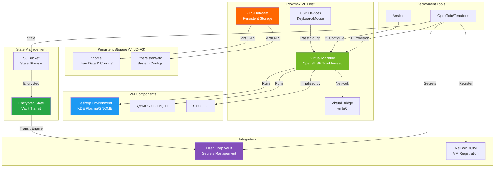

# OpenSUSE Tumbleweed VM Workstation Deployment

[](https://opentofu.org/)
[](https://www.ansible.com/)
[](https://www.proxmox.com/)
[](https://www.opensuse.org/)

Automated deployment of an OpenSUSE Tumbleweed workstation VM in Proxmox VE using Infrastructure as Code (IaC) principles. This project combines OpenTofu (Terraform) for infrastructure provisioning and Ansible for configuration management, creating a fully-featured desktop environment with USB device passthrough support.

## 📋 Table of Contents

- [Overview](#-overview)
- [Architecture](#-architecture)
- [Features](#-features)
- [Prerequisites](#-prerequisites)
- [Quick Start](#-quick-start)
- [Project Structure](#-project-structure)
- [Configuration](#-configuration)
- [USB Device Passthrough](#-usb-device-passthrough)
- [Security Considerations](#-security-considerations)
- [Troubleshooting](#-troubleshooting)
- [Maintenance](#-maintenance)

> 📖 **Detailed Deployment Guide**: See [DEPLOYMENT.md](DEPLOYMENT.md) for comprehensive step-by-step deployment instructions.

## 🔍 Overview

This project automates the complete deployment lifecycle of an OpenSUSE Tumbleweed workstation VM on Proxmox VE. It provides:

- **Infrastructure Provisioning**: OpenTofu/Terraform creates and configures the VM with UEFI support
- **Configuration Management**: Ansible installs desktop environment and software packages
- **USB Passthrough**: Direct USB device access for keyboards, mice, and peripherals
- **State Encryption**: Vault Transit engine encryption for Terraform state files
- **Remote State Storage**: S3-compatible backend with locking support
- **Cloud-Init Provisioning**: Automated user and network configuration

### Why OpenSUSE Tumbleweed?

OpenSUSE Tumbleweed is a rolling-release distribution that provides:

- **Latest Software**: Always up-to-date packages with cutting-edge features
- **Stability**: Rigorous testing via openQA before release
- **Btrfs by Default**: Advanced filesystem with snapshots and rollback
- **YaST**: Powerful system configuration tool
- **Enterprise Foundation**: Built on SUSE Linux Enterprise codebase

### Use Cases

- **Development Workstation**: Full-featured desktop environment for software development
- **Testing Environment**: Rolling release for testing latest software versions
- **Desktop Virtualization**: Remote desktop access with USB device support
- **Multimedia Workstation**: Audio/video production with hardware passthrough

## 🏗️ Architecture



### Data Persistence Model

This project uses **VirtIO-FS** to share host ZFS datasets with the VM, enabling data to persist independently of the VM lifecycle:

```text
Host (Proxmox)                          VM (Guest)
─────────────────                       ─────────────
/<pool>/vm_workstation/home    ──▶      /home (virtiofs mount)
/<pool>/vm_workstation/etc     ──▶      /persistent/etc (virtiofs mount)
                                         ├── NetworkManager → /etc/NetworkManager (symlink)
                                         └── systemd/system → /etc/systemd/system (symlink)
```

**Key Benefits:**

- 🔄 **VM Recreation Safe**: Destroy and recreate VM without losing user data
- 📦 **User Settings Preserved**: Application configs in ~/.config, ~/.local persist
- 🔧 **Selective /etc Persistence**: Network configs, custom services survive reinstall
- 🔑 **Permission Consistency**: Fixed UID 1000 ensures ownership matches across recreations

## ✨ Features

### Infrastructure (OpenTofu/Terraform)

- ✅ **UEFI/OVMF Boot Support** for modern operating systems
- ✅ **High-Performance CPU** with host passthrough option
- ✅ **Flexible Resource Allocation** (CPU, RAM, Disk)
- ✅ **VirtIO-FS Persistent Storage** (ZFS-backed /home and /etc)
- ✅ **USB Device Passthrough** (up to 4 devices)
- ✅ **Network Configuration** (Static IP or DHCP)
- ✅ **Cloud-Init Provisioning** for automated setup
- ✅ **QEMU Guest Agent** for Proxmox integration
- ✅ **Encrypted State Files** using Vault Transit engine
- ✅ **S3 Remote State Backend** with locking
- ✅ **NetBox DCIM Integration** for VM registration

### Persistent Storage (VirtIO-FS)

- ✅ **User Data Persistence** - /home survives VM destruction
- ✅ **Config Preservation** - ~/.config, ~/.local preserved
- ✅ **Selective /etc Persistence** - NetworkManager, systemd units
- ✅ **Fresh vs Reconnect Detection** - Ansible handles both scenarios
- ✅ **Fixed UID Consistency** - Permissions match across recreations
- ✅ **ACL & Xattr Support** - Full POSIX permissions via VirtIO-FS

### Configuration (Ansible)

- ✅ **Desktop Environment Installation** (KDE Plasma or GNOME)
- ✅ **Software Package Management** via zypper
- ✅ **System Hardening** (SSH, firewall configuration)
- ✅ **User Management** with Ansible automation user
- ✅ **Idempotent Playbooks** (safe to re-run)
- ✅ **Role-Based Organization** for maintainability

### Security

- 🔒 **State File Encryption** (Vault Transit engine)
- 🔒 **SSH Key-Only Authentication**
- 🔒 **Secure Password Generation** (25+ characters)
- 🔒 **Vault Integration** for secrets management
- 🔒 **Firewall Configuration** (firewalld)
- 🔒 **Comprehensive .gitignore** to prevent credential leaks

## 📦 Prerequisites

> 🔗 **HomeLab Infrastructure**: This project integrates with the HomeLab infrastructure. See the [root README](../README.md) for the complete deployment order and architecture overview.

### Deployment Order

**Deploy After Vault** - This project requires HashiCorp Vault for secrets management and state encryption.

**Dependencies**:

- **lxc_vault**: Required for secrets management and state encryption
- **lxc_netbox**: Optional for DCIM registration

### Required Software

| Tool | Version | Purpose |
| ------ | --------- | --------- |
| **Proxmox VE** | 8.4+ | Hypervisor platform (VirtIO-FS support) |
| **OpenTofu** | 1.8+ | Infrastructure provisioning (or Terraform 1.7+) |
| **Ansible** | 2.15+ | Configuration management |
| **Python** | 3.9+ | Ansible runtime |
| **SSH Client** | Any | Remote access |

### Proxmox Configuration

1. **OpenSUSE Tumbleweed Cloud Image**

   Download the latest cloud image to Proxmox:

   ```bash
   # On Proxmox host or via Terraform (automated)
   # Image URL configured in terraform.tfvars
   ```

2. **Vault Integration**
   - HashiCorp Vault deployed and accessible
   - Transit engine enabled for state encryption
   - Required secrets stored in Vault KV

3. **Network Bridge Available**
   - Default: `vmbr0` (configured during Proxmox installation)
   - Verify: `ip link show vmbr0`

### SSH Key Pair

```bash
# Generate SSH key for root access
ssh-keygen -t ed25519 -C \"opensuse-vm-root\" -f ~/.ssh/pve_ssh

# Generate separate key for Ansible automation (recommended)
ssh-keygen -t ed25519 -C \"ansible@opensuse-vm\" -f ~/.ssh/ansible
```

## 🚀 Quick Start

### Automated Deployment

```bash
# Navigate to project directory
cd /path/to/HomeLab(Proxmox)/vm_opensuseTumbleweed

# Create configuration files from examples
cd terraform
cp terraform.tfvars.example terraform.tfvars
cp s3.backend.config.template s3.backend.config

# Edit configuration with your values
vim terraform.tfvars
vim s3.backend.config

# Initialize Terraform with S3 backend
tofu init -backend-config=s3.backend.config

# Review planned changes
tofu plan

# Apply infrastructure
tofu apply

# Configure with Ansible
cd ../ansible
cp inventory.yml.example inventory.yml
vim inventory.yml  # Update with VM IP from Terraform output

# Deploy configuration
ansible-playbook site.yml
```

### Access the VM

```bash
# SSH access
ssh ansible@<vm-ip>

# Or use Proxmox console
# Navigate to VM in Proxmox web UI → Console
```

## 📁 Project Structure

```text
vm_opensuseTumbleweed/
├── .gitignore                        # Git ignore patterns
├── logs/                             # Deployment logs (auto-generated)
│
├── scripts/                          # Helper scripts
│   ├── common.sh                     # Logging and utility functions
│   ├── vault.sh                      # Vault authentication and AWS credentials
│   ├── terraform.sh                  # Terraform/OpenTofu operations
│   └── ansible.sh                    # Ansible inventory and execution
│
├── terraform/                        # Infrastructure provisioning
│   ├── main.tf                       # VM resource definition
│   ├── variables.tf                  # Variable definitions
│   ├── outputs.tf                    # Output values
│   ├── providers.tf                  # Provider configuration
│   ├── backend.tf                    # S3 backend configuration
│   ├── encryption.tf                 # State encryption setup
│   ├── netbox.tf                     # NetBox DCIM registration
│   ├── cloud-init.tf                 # Cloud-init configuration
│   ├── terraform.tfvars.example      # Example variables
│   └── s3.backend.config.template    # Example S3 config
│
└── ansible/                          # Configuration management
    ├── ansible.cfg                   # Ansible configuration
    ├── site.yml                      # Main playbook
    ├── inventory.yml.example         # Example inventory
    ├── group_vars/all.yml            # Global variables
    │
    └── roles/                        # Ansible roles
        ├── persistence/              # VirtIO-FS mounts and /etc symlinks
        ├── common/                   # Base system (firewall, sudoers, packages)
        ├── software_installation/    # Flatpak, Brave, VSCode, development tools
        └── desktop_environment/      # KDE Plasma or GNOME installation
```

## 🔧 Configuration

### Key Configuration Files

#### 1. Terraform Variables (`terraform/terraform.tfvars`)

Essential settings to customize:

```hcl
# VM Identity
vm_id = 400
vm_hostname = \"opensuseTumbleweed-vm\"
vm_ip_address = \"192.168.0.210/24\"
vm_gateway = \"192.168.0.1\"

# Resources
vm_cpu_cores = 2
vm_cpu_type = \"x86-64-v2-AES\"  # or \"host\" for maximum performance
vm_memory_dedicated = 4096
vm_boot_disk_size = 32

# USB Device Passthrough (optional)
vm_usb_device_1_host = \"212e:1534\"  # Keyboard
vm_usb_device_2_host = \"1-4\"        # Mouse
vm_usb_device_3_host = \"4-2.4\"      # Additional device
vm_usb_device_4_host = \"046d:c328\"  # Another device

# Vault Integration
vault_address = \"http://192.168.1.50:8200\"
transit_key_name = \"vm-opensuse-tumbleweed\"
```

#### 2. Ansible Inventory (`ansible/inventory.yml`)

```yaml
all:
  children:
    opensuse_vms:
      hosts:
        opensuse-workstation:
          ansible_host: 192.168.0.210
          ansible_user: ansible
          ansible_ssh_private_key_file: ~/.ssh/ansible
      vars:
        ansible_become: true
```

#### 3. Cloud-Init Configuration (Generated)

Automatically configured via Terraform with:

- Network settings (static IP or DHCP)
- DNS servers
- Ansible user creation with SSH key
- Initial system setup

## 🔌 USB Device Passthrough

### Finding USB Devices

On the Proxmox host, run:

```bash
lsusb
```

Example output:

```text
Bus 001 Device 003: ID 046d:c328 Logitech, Inc. Corded Mouse M500
Bus 004 Device 002: ID 413c:2113 Dell Computer Corp. KB216 Keyboard
```

### USB ID Formats

**Format 1: Vendor:Product ID** (recommended)

```hcl
vm_usb_device_1_host = \"046d:c328\"  # Logitech Mouse
```

- Use when device may be plugged into different USB ports
- All devices with same vendor:product will be passed through

**Format 2: Hub Port** (specific port)

```hcl
vm_usb_device_1_host = \"1-4\"  # Bus 1, Port 4
```

- Use when you need specific physical port passthrough
- Device must remain in the same USB port

### USB 3.0 vs USB 2.0

```hcl
vm_usb_device_1_usb3 = false  # Keyboards, mice (better compatibility)
vm_usb_device_2_usb3 = true   # Storage devices (higher performance)
```

### Important Notes

- ⚠️ Passed-through USB devices are NOT accessible to Proxmox host
- Hot-plug support depends on guest OS and device drivers
- USB hubs can be passed through to passthrough all connected devices
- Some devices (webcams, audio) may need additional configuration

## 🔐 Security Considerations

### Critical Security Items

1. **🔑 State File Encryption**
   - Uses Vault Transit engine for state encryption
   - Transit key stored in HashiCorp Vault
   - Automatic encryption/decryption during Terraform operations

2. **🔒 Network Security**
   - VM exposed on configured network interface
   - **Production**: Configure firewall rules (firewalld)
   - Consider VPN or internal network only

3. **👤 VM Security**
   - Root password auto-generated (retrieve via Terraform output)
   - SSH key authentication enforced
   - Ansible user with sudo access for automation

4. **🖥️ Desktop Security**
   - Regular system updates via zypper
   - Firewall enabled by default (firewalld)
   - User account security best practices

### Security Checklist

- [ ] Configure firewall rules (firewalld)
- [ ] Set up automatic system updates
- [ ] Enable disk encryption (optional)
- [ ] Configure backup strategy
- [ ] Review and harden SSH configuration
- [ ] Implement user access controls
- [ ] Monitor system logs
- [ ] Regular security audits

### Best Practices

1. **Separate SSH Keys**: Use different keys for root and Ansible user
2. **Principle of Least Privilege**: Limit Ansible user sudo commands if possible
3. **Regular Updates**: Keep OpenSUSE Tumbleweed and packages updated
4. **Backup Strategy**: Regular backups of data disk
5. **Monitoring**: Set up monitoring for VM health
6. **Snapshots**: Use Proxmox snapshots before major changes

## 🔧 Troubleshooting

### Common Issues

#### VM Won't Boot

**Symptoms**: VM starts but doesn't boot to OS

**Solutions**:

1. Check BIOS setting (should be `ovmf` for UEFI)
2. Verify boot order in `vm_boot_order`
3. Check cloud image download completed successfully
4. Review Proxmox console for error messages

#### USB Devices Not Working

**Symptoms**: USB devices not detected in VM

**Solutions**:

1. Verify USB device ID with `lsusb` on Proxmox host
2. Try different USB port or format (vendor:product vs hub-port)
3. Check USB 3.0 setting matches device capabilities
4. Ensure device is not in use by Proxmox host

#### Network Configuration Issues

**Symptoms**: VM has no network connectivity

**Solutions**:

1. Verify network bridge exists: `ip link show vmbr0`
2. Check IP address configuration in terraform.tfvars
3. Verify gateway and DNS settings
4. Check firewall rules on Proxmox host

#### Ansible Playbook Fails

**Symptoms**: Ansible playbook execution fails

**Solutions**:

1. Verify SSH connectivity: `ansible all -m ping`
2. Check Ansible user has sudo access
3. Ensure python3-zypp is installed (pre-task in playbook)
4. Review Ansible logs for specific error messages

## 🔄 Maintenance

### Regular Updates

```bash
# SSH into VM
ssh ansible@<vm-ip>

# Update system packages
sudo zypper refresh
sudo zypper update

# Reboot if kernel updated
sudo reboot
```

### Backup Strategy

**Data Disk Backup**:

```bash
# On Proxmox host
vzdump <vmid> --mode snapshot --storage <backup-storage>
```

**Proxmox Snapshots**:

- Create snapshots before major changes
- Use Proxmox web UI or CLI
- Regular snapshot rotation policy

### Monitoring

**QEMU Guest Agent**:

- Provides VM metrics to Proxmox
- Enables graceful shutdown
- Reports IP address and resource usage

**System Monitoring**:

```bash
# Check system status
systemctl status

# Monitor resources
htop

# Check disk usage
df -h
```

## 📖 Additional Resources

- [OpenSUSE Tumbleweed Documentation](https://doc.opensuse.org/)
- [Proxmox VE Documentation](https://pve.proxmox.com/wiki/Main_Page)
- [OpenTofu Documentation](https://opentofu.org/docs/)
- [Ansible Documentation](https://docs.ansible.com/)
- [Cloud-Init Documentation](https://cloudinit.readthedocs.io/)

## 📄 License

This project is licensed under the MIT License - see individual project LICENSE files for details.

---

**Last Updated**: February 2026

**Maintained By**: HomeLab Infrastructure Team

For project-specific questions, see [DEPLOYMENT.md](DEPLOYMENT.md) for detailed deployment instructions.
